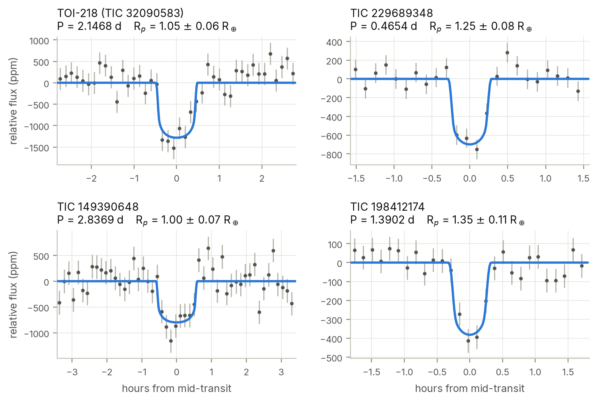
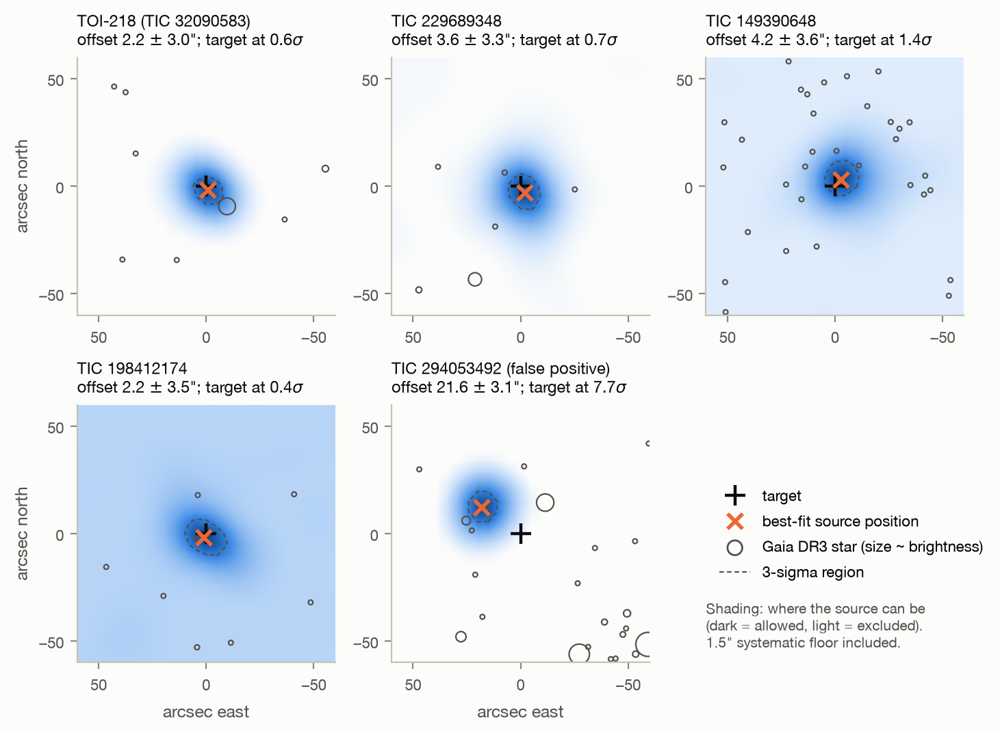

# TESS M-dwarf deep search

A transit search of the **1,279 M dwarfs that NASA's TESS has observed the longest** (20–44 sectors of
2-minute photometry each, Sectors 1–107), with every candidate checked in the light curve, in the pixels,
statistically, and against NASA's own pipeline.

**Project page: [aidenn8.github.io/tess-planet-search](https://aidenn8.github.io/tess-planet-search/)**

**Result: four Earth-sized planet candidates in no existing catalogue**, including a third transiting
signal in the TOI-218 system and an 11-hour orbit around TIC 229689348, plus one first-pass candidate
traced to a nearby eclipsing binary.



## Candidates

| | period | radius | T_eq | SNR | source offset | FPP | status before this work |
|---|---|---|---|---|---|---|---|
| **TOI-218** (TIC 32090583), new signal | 2.1468 d | 1.05 ± 0.06 R⊕ | 578 K | 11.1 | 2.2 ± 3.0″ | 0.09 | in no list |
| **TIC 229689348** | 0.4654 d (11.2 h) | 1.25 ± 0.08 R⊕ | 1130 K | 10.4 | 3.6 ± 3.3″ | 0.20 | SPOC TCE, never a TOI |
| **TIC 149390648** | 2.8369 d | 1.00 ± 0.07 R⊕ | 581 K | 9.1 | 4.2 ± 3.6″ | 0.09 | SPOC TCE, never a TOI |
| **TIC 198412174** | 1.3902 d | 1.35 ± 0.11 R⊕ | 954 K | 9.7 | 2.2 ± 3.5″ | 0.48 | SPOC TCE, never a TOI |
| TIC 294053492 | 1.0853 d | – | – | 7.9 | **21.6 ± 3.1″** | – | nearby eclipsing binary |

*Radius includes the stellar-radius uncertainty. Source offset: where the light goes missing, relative to
the target (pixel-level localization). FPP: TRICERATOPS false-positive probability with neighbours
excluded by the pixels cleared, before high-resolution imaging.*

All four candidates meet the TRICERATOPS *likely planet* criteria (FPP < 0.5, NFPP < 0.001). TOI-218 is
the only one with existing high-resolution imaging (Gemini-South speckle, 2020); with it, the new
signal's FPP falls to 1.4 × 10⁻⁵, below the thresholds TRICERATOPS uses for statistical validation. It is
not called validated here because its host flares and no ground-based light curve has yet seen the
transit. None is confirmed. What each candidate needs, with transit windows and neighbour checklists, is
in **[FOLLOW_UP.md](FOLLOW_UP.md)**.
Full dossiers: [`results/candidates/`](results/candidates/).

## How the candidates were tested

1. **Search.** Each star's light curve was cleaned of flares, detrended, and searched for periodic dips
   from 0.4 to 40 days with box least squares run per observing season and stacked across seasons.
   1,560 signals were found. [Chapter 1](docs/01-data-and-search.md)
2. **Light-curve vetting.** Eighteen tests for eclipsing binaries, contamination, artefacts and stellar
   variability, with noise measured at the transit timescale and centroid statistics calibrated against
   fake transit epochs. 73 signals passed; 26 matched no known planet, TOI or community TOI (3 had been
   SPOC detections never promoted), 5 of them at full candidate strength. [Chapter 2](docs/02-vetting.md)
3. **Sensitivity and reliability.** The pipeline recovers 25 of 26 confirmed transiting planets in range,
   keeps 74% of 300 planets injected into real light curves (89% of 2–4 R⊕ planets inside 15 days), and
   produces no false candidates from 200 inverted light curves. [Chapter 3](docs/03-sensitivity-and-reliability.md)
4. **Pixel-level localization.** Difference images from every sector, fitted jointly with NASA's pixel
   response function, locate where the light goes missing. Validated on 11 confirmed planets (all on
   target), 3 known nearby eclipsing binaries (all off target) and 39 eclipses planted in the real pixels
   (34 of 35 reliable fits traced to the right star). [Chapter 4](docs/04-pixel-level-localization.md)
5. **Transit fits and statistical validation.** MCMC transit fits checked against TOI-700 d and
   L 98-59 c; NASA pipeline reports re-analysed; false-positive probabilities from TRICERATOPS.
   [Chapter 5](docs/05-transit-fits-and-false-positive-probabilities.md)



## Notable findings

* **TOI-218 is one star of a wide binary.** A near-twin M dwarf with the same parallax and proper motion
  sits 13.5″ away and is blended with it in TESS. All three TOI-218 signals, including the new one, come
  from TOI-218 itself; the companion is excluded at 4.4–8.7σ.
* **NASA's pipeline saw three of the candidates.** Its reported SNR fell as data accumulated because its
  period estimates drifted, not because the signals faded. The 55″ source offset it reported for
  TIC 229689348 came from difference images that failed its own quality metric.
* **One first-pass candidate is a nearby eclipsing binary.** TIC 294053492 passed every light-curve test;
  its light loss lies on a G = 19.8 background star 22″ away, with the target excluded at 7.7σ.
* **Most weak signals are noise.** 21 weaker signals cluster where few transits are observed; 6 of them
  are not reproduced in the pixels at all. [Chapter 7](docs/07-weak-signals.md)

## Documentation

| | |
|---|---|
| [project page](https://aidenn8.github.io/tess-planet-search/) | overview, write-up and follow-up guide as a website (`site/build.py`) |
| [`docs/`](docs/) | full technical write-up in eight chapters, with figures |
| [`results/candidates/`](results/candidates/) | one dossier per signal |
| [`REPORT.md`](REPORT.md) | generated summary of every number |
| [`EXPLAINER.md`](EXPLAINER.md) | plain-language summary |
| [`paper/`](paper/) | draft Research Note of the AAS |
| [`results/hardening/exofop/`](results/hardening/exofop/) | draft ExoFOP community-TOI upload (not submitted) |

## Reproducing

```bash
uv venv --python 3.12 .venv && uv pip install --python .venv/bin/python -r requirements.txt
uv venv --python 3.12 .venv-tri && uv pip install --python .venv-tri/bin/python -r requirements-triceratops.txt
.venv/bin/python -m pytest tests/
```

The full pipeline (`scripts/01`–`16`) downloads about 56 GB from MAST and ran on a fanless MacBook Air
under a thermal guard; the complete sequence of commands, compute times and seeds are in
[Chapter 8](docs/08-limitations-and-reproducibility.md).

| path | contents |
|---|---|
| `tess_search/` | library: selection, download, cleaning, search, vetting, crossmatch, injection, localization, MCMC |
| `scripts/` | numbered pipeline steps |
| `results/` | all outputs, from per-star search records to candidate dossiers |
| `docs/` | technical write-up and figures |
| `tools/thermal/` | thermal guard for long jobs on a fanless laptop |
| `tests/` | unit tests |

## Data

TESS light curves, target pixel files and SPOC Data Validation products from MAST; TESS Input Catalog
v8.2; Gaia DR3 via VizieR; TOI, CTOI and confirmed-planet lists from ExoFOP and the NASA Exoplanet
Archive. Raw data are not stored here and are re-downloaded by the scripts.

## License

Code is released under the [MIT License](LICENSE).
