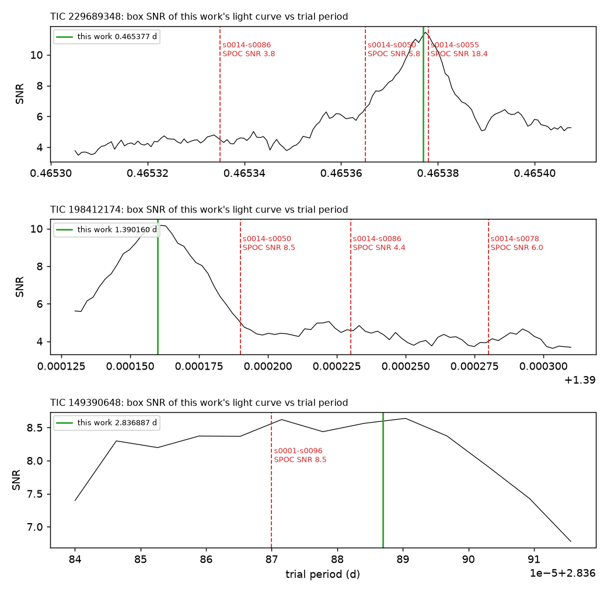
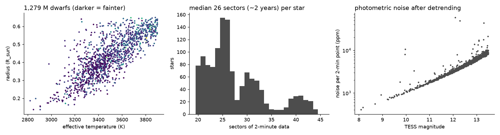
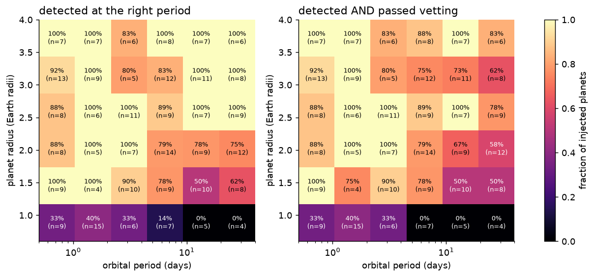
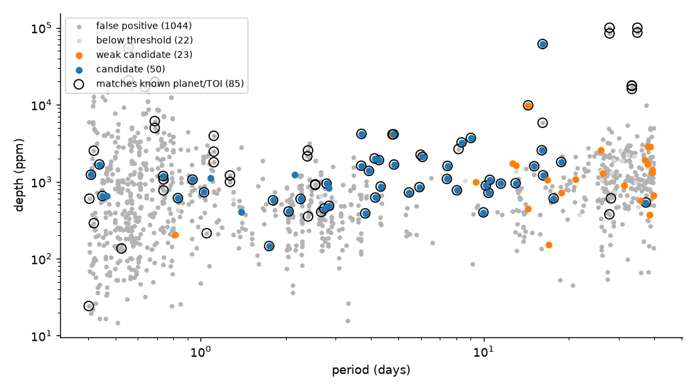

# TESS M-dwarf deep search: report

*Generated by `scripts/09_report.py` from the files in `results/`; the candidate assessments are hand-written in `tess_search/assessments.py`.*

## Key findings

* Searched the **1,279 bright M dwarfs** that TESS has watched longest (>= 20 sectors, through sector 107) for transiting planets with periods of 0.4-40 days.
* The pipeline independently recovers **25 of 26 confirmed transiting planets** in that range (and 82 of 89 catalogued signals that can transit), including all four planets of TOI-700, and passes them through vetting.
* **Completeness** (300 injected planets): 79.7% detected, 74.0% detected and passed vetting; 88.6% for planets of 2-4 R_earth inside 15 days, 55.3% for planets under 1.5 R_earth inside 5 days.
* **Reliability** (200 flipped light curves): **no false candidates** (95% upper limit 1.5% of stars); false *weak* candidates on 3.0% of stars.
* **5 signals in no planet catalogue** passed every light-curve test. A second, deeper pass checked each one in the pixels, statistically and against NASA's own pipeline (see *Hardening*): **4 remain candidates** (TIC 32090583 (TOI-218), TIC 229689348, TIC 198412174, TIC 149390648; 1.00-1.35 R_earth, periods 0.47-2.84 d), and **1 is a nearby eclipsing binary** (TIC 294053492: the light loss is 22" from the target).
* The pixel-level localization was validated first: 11 confirmed planets come out on their own star (all within 1.5 sigma), 3 TFOP-retired nearby eclipsing binaries come out off target, and 34 of 35 synthetic eclipses planted in the real pixels are traced to the right star.
* **Statistical validation (TRICERATOPS, no imaging):** with the neighbours that the pixels exclude treated as cleared, 4 of 4 candidates meet TRICERATOPS's *likely planet* criteria (FPP < 0.5, NFPP < 0.001): TIC 32090583 FPP 0.08, TIC 149390648 FPP 0.09, TIC 229689348 FPP 0.20, TIC 198412174 FPP 0.48. None is validated (FPP < 0.015 with high-resolution imaging); the remaining FPP is mostly unresolved bound companions, which imaging tests directly.
* 21 weaker signals are listed separately; most are expected to be false alarms, and many sit at 36-40 d periods where noise produces them (see *Weak candidates*).

## Candidates

Each signal was re-vetted from scratch, fitted with an MCMC transit model (planet radius includes the stellar-radius uncertainty), localized in the pixels, run through TRICERATOPS, and compared with NASA's SPOC pipeline where SPOC had flagged it. A candidate is a signal worth follow-up observations, **not a confirmed planet**. Full dossiers: `results/candidates/`.

| TIC | verdict | period (d) | radius (R_earth) | T_eq (K) | SNR | source offset from target | FPP / NFPP (TESS only) | FPP / NFPP (localization-cleared) |
|---|---|---|---|---|---|---|---|---|
| 32090583 (TOI-218) | Candidate (strongest) | 2.146798 | 1.05 ± 0.06 | 578 | 11.1 | 2.2 ± 3.0" | 0.414 / 0.3588 | 0.082 / 0.0003 |
| 229689348 | Candidate | 0.465377 | 1.25 ± 0.08 | 1131 | 10.4 | 3.6 ± 3.3" | 0.199 / 0.0010 | 0.197 / 0.0000 |
| 198412174 | Candidate (ambiguous host) | 1.390160 | 1.35 ± 0.11 | 954 | 9.7 | 2.2 ± 3.5" | 0.461 / 0.0007 | 0.478 / 0.0000 |
| 149390648 | Candidate | 2.836887 | 1.00 ± 0.07 | 581 | 9.1 | 4.2 ± 3.6" | 0.092 / 0.0047 | 0.088 / 0.0009 |
| 294053492 | False positive: nearby eclipsing binary | 1.085265 | 1.29 ± 0.09 | 852 | 7.9 | 21.6 ± 3.1" | 0.340 / 0.2998 | n/a |

**TIC 32090583.** A **third transiting signal in the TOI-218 system**, found after the two known TOIs were masked: 1.05 ± 0.06 R_earth on a 2.1468-d orbit (T_eq ~578 K), not in any TOI, CTOI or SPOC TCE list. TOI-218 is one star of a wide binary: a near-twin M dwarf (same parallax and proper motion) sits 13.5" away and is blended with it in TESS. The pixel localization puts the new signal on the target (2.2 ± 3.0") and excludes the companion at 4.4 sigma; the two known TOI-218 signals also come from the target (8.7 and 6.8 sigma against the companion). The pixels lose 1.25 ± 0.18 times the light the light-curve depth predicts, and both halves of the data recover it (SNR 11.0 and 8.4). From TESS photometry alone TRICERATOPS gives FPP = 0.41 and NFPP = 0.36, almost all of it the scenario that the planet orbits the equal-brightness companion, which TRICERATOPS cannot tell apart without pixel information; with the companion and the other neighbours the localization excludes treated as cleared, FPP = 0.082 and NFPP = 0.0003. TFOP notes call the host an eruptive (flaring) variable and suspect TOI-218.01 is stellar variability; flares are removed here and the new signal is a flat-bottomed, periodic, ~0.9-h dip seen in 400+ transits, unlike spot or flare activity. Extra candidates in systems that already have candidates are more often real. Next step: ground-based photometry that resolves the binary, an independent check of which star hosts each of the three signals. Dossier: `results/candidates/TIC32090583.md`.

**TIC 229689348.** An **ultra-short-period candidate: 1.25 ± 0.08 R_earth on an 11.2-hour orbit** (T_eq ~1131 K, ~272x Earth's insolation), flat-bottomed, in 1088 transits and in both halves of the data. NASA's pipeline flagged it in three multi-sector runs but never promoted it; its reported SNR (5.8, 18.4, 3.8) tracks how far its period estimate was from the true one, not a fading signal. SPOC's difference images put the source 55" away in its best run, but none of them passed SPOC's own quality test; the joint PRF localization here, at the correct period with all 25 sectors, puts it on the target (3.6 ± 3.3"), excludes the bright 48.7" neighbour SPOC's offset pointed towards at 8.0 sigma and the 9.2" neighbour at 4.6 sigma, and synthetic eclipses planted on those neighbours are correctly traced to them. Pixel/light-curve depth ratio 1.02 ± 0.15. TRICERATOPS: FPP = 0.199, NFPP = 0.0010; the planet-on-target scenario carries 68% and the rest is almost all unresolved-companion scenarios (20% a planet on a bound companion), which high-resolution imaging would test; with the neighbours the localization excludes treated as cleared the neighbour scenarios vanish (NFPP = 0.00000, FPP = 0.197). The transit is short for this star (b ~ 0.80), and the transit shape alone prefers a denser star (density 3.1 +1.4 -2.0 x the TIC value), which TRICERATOPS reads as some weight on a companion host. Dossier: `results/candidates/TIC229689348.md`.

**TIC 198412174.** **1.35 ± 0.11 R_earth on a 1.3902-d orbit**, nearly grazing (b ~ 0.93). SPOC flagged it in three runs; as for TIC 229689348 the falling SPOC SNR follows SPOC's period error. The pixels put the source on or very near the target (2.2 ± 3.5") but **cannot separate the target from a T = 18.2 star 4.7" away** (excluded at only 1.3 sigma; it would need a ~11% eclipse); the planted-eclipse test shows that this pair is below the method's resolution. TRICERATOPS: FPP = 0.461 (NFPP 0.0007), dominated by a planet transiting an unresolved bound companion (46%) rather than the target (45%), because the transit is short for this star; clearing the neighbours the localization excludes gives FPP = 0.478, NFPP = 0.00001. High-resolution imaging (to find or exclude a companion and the 4.7" star) is the decisive next step. Dossier: `results/candidates/TIC198412174.md`.

**TIC 149390648.** **1.00 ± 0.07 R_earth on a 2.8369-d orbit** (T_eq ~581 K) in a crowded southern field. SPOC flagged it once (s1-s96, SNR 8.5) and its difference-image offset was 2.2 ± 3.3", consistent with the target; this localization agrees (4.2 ± 3.6", every neighbour excluded at 3 sigma). The first half of the data alone does not lock onto the period (SNR 5.4 at a different period; second half 7.6 at this one), and the pixels lose 1.47 ± 0.23 times the expected light, the highest ratio in the set, which in a crowded field can mean the PDC crowding correction is imperfect. TRICERATOPS: FPP = 0.092, NFPP = 0.0047 from TESS photometry alone, the NFPP coming from many faint neighbours; with those the localization excludes treated as cleared, FPP = 0.088 and NFPP = 0.00093. The last neighbour scenario left is TIC 149390646, a TIC entry with T = 17.0 and no Gaia counterpart; Gaia DR3 sees only a G = 21.6 source there, far too faint to make the dip. Ground-based photometry would settle it. Dossier: `results/candidates/TIC149390648.md`.

**TIC 294053492.** **Not a planet candidate on this star.** The light-curve signal (1.0853 d, depth ~856 ppm) passed every light-curve test, but the pixels place the light loss 21.6 ± 3.1" north-east of the target, excluding the target at 7.7 sigma; odd and even sectors each give the same off-target position on their own. The best-matching Gaia DR3 source is 5486535775331400832 (G = 19.8, 22.7" from the target and 2.1" from the best-fit position), which would need a ~16% eclipse: an ordinary eclipsing binary. More light goes missing than the target could lose for this depth (1.76x). TRICERATOPS, which has no pixel information, also flags a neighbour (NFPP = 0.30) but blames the bright star 22.6" to the north-west, which the pixels exclude at 8.3 sigma; the faint true source carries little prior weight there. This is what the hardening pass is for; the earlier write-up listed it as one of five candidates. Dossier: `results/candidates/TIC294053492.md`.

The ExoFOP community-TOI upload is drafted in `results/hardening/exofop/params_planet_DRAFT.txt` (not submitted; it needs the submitter's ExoFOP username as its tag).

## Hardening

### Is the light lost on the target? Pixel-level localization

TESS pixels are 21" wide, so a neighbouring eclipsing binary can leak a planet-sized dip into the target's light curve. For every sector the images taken during transit are subtracted from those taken just before and after; the result shows only the light that disappeared. All sectors are then fitted together with NASA's model of how a point source spreads over the pixels (the SPOC PRF), calibrated per sector on the Gaia stars in the image, to find where on the sky the light went missing (`tess_search/localize.py`). Pixel errors come from ~60 fake transits per sector; flares are removed first.

| test | signal | source offset from target | target excluded at | reduced chi2 |
|---|---|---|---|---|
| confirmed planet | L98-59b | 1.0 ± 2.3" | 0.2 sigma | 1.28 |
| confirmed planet | L98-59c | 0.0 ± 2.3" | 0.0 sigma | 1.19 |
| confirmed planet | L98-59d | 0.0 ± 2.3" | 0.0 sigma | 1.15 |
| confirmed planet | TOI-1756b | 3.2 ± 2.7" | 1.2 sigma | 1.20 |
| confirmed planet | TOI-2084b | 1.0 ± 2.7" | 0.2 sigma | 1.11 |
| confirmed planet | TOI-2094b | 0.0 ± 2.9" | 0.0 sigma | 1.03 |
| confirmed planet | TOI-5728b | 1.4 ± 3.3" | 0.3 sigma | 1.21 |
| confirmed planet | TOI-6000b | 4.5 ± 2.9" | 1.5 sigma | 1.01 |
| confirmed planet | TOI-700b | 4.1 ± 3.3" | 1.1 sigma | 1.28 |
| confirmed planet | TOI-700c | 0.0 ± 2.3" | 0.0 sigma | 1.20 |
| confirmed planet | TOI-700d | 1.0 ± 3.3" | 0.1 sigma | 1.26 |
| TFOP: nearby EB | TOI-2084.02 | 13.0 ± 2.5" | 7.4 sigma | 1.12 |
| TFOP: nearby EB | TOI-2283.01 | 28.5 ± 6.2" | 3.5 sigma | 1.39 |
| TFOP: nearby EB | TOI-419.01 | 26.8 ± 2.3" | 37.0 sigma | 1.52 |

39 synthetic eclipses were planted in the real pixels (on the target, and on the neighbours that could most easily mimic each signal, sized to reproduce its depth). Of the 35 with a reliable fit, 34 were traced to the right star (the exception is a target/neighbour pair 4.7" apart, below the method's resolution); for 22 of 24 planted on neighbours (4.7-83" away) the target was excluded at more than 3 sigma. 4 injections around TOI-6000 gave a poor fit (reduced chi2 > 2): a variable star in that image happens to vary in step with the injected period, which breaks the one-source assumption. Such fits are flagged unreliable; none of the candidates is affected (reduced chi2 1.06-1.16).

The position errors include a 1.5" systematic floor: the smallest floor for which 95% of the 46 cases with a known source fall inside their 2-sigma region is 1.4".

### NASA's own pipeline (SPOC) on the same signals

Three candidates were SPOC Threshold Crossing Events that never became TOIs. SPOC's reported SNR fell as data were added; folding this work's light curve at SPOC's period for each run reproduces the drop (the transit smears by 1-4 hours over the baseline), so the signals did not fade. SPOC's difference-image centroids for these runs are listed in the dossiers; none of its 135 per-sector difference images passed SPOC's own quality test. The run that put TIC 229689348's source 55" away (s14-s55) used the correct period, but its difference images were among those that failed; the localization above, built at the correct period from all sectors, places that source on the target.

### Statistical validation (TRICERATOPS)

TRICERATOPS (Giacalone et al. 2021) weighs a planet on the target against eclipsing binaries on the target, unresolved companions, background stars and resolved neighbours, using the transit shape and the Gaia DR3 field population (queried through VizieR). Each candidate was run 5 times with 10^6 draws. TRICERATOPS uses only brightness ratios and the transit shape; it is run a second time with the neighbours that the pixel localization excludes at more than 3 sigma treated as cleared (as stars cleared by ground-based photometry are). No high-resolution imaging was used, so these FPPs are conservative; validation needs FPP < 0.015 and NFPP < 0.001 with imaging. Values are in the candidate table above.

## Data

* **1,279 M dwarfs** (Teff <= 3900 K, R <= 0.65 R_sun, TESS mag <= 13.5, low contamination) with **>= 20 sectors** of SPOC 2-minute photometry; median 26 sectors, max 44.
* Chosen from 1,735,111 light-curve files of 592,592 stars in sectors 1-107. NASA's latest combined multi-sector search covered sectors 1-96.
* 1,560 periodic signals detected; 1,139 strong enough to vet.

## Validation on known planets

Of 97 catalogued signals with periods 0.4-40 d on the searched stars, 84 were recovered. Of the 13 missed, 5 are confirmed planets found by radial velocity that **do not transit** (no transit search can see them) and one is a known false alarm. The real misses:

| star | signal | period (d) | disposition |
|---|---|---|---|
| TIC 198162530 | TOI-5738.01 | 0.7681 | PC |
| TIC 272466980 | CTOI-272466980.01 | 3.4561 | PC |
| TIC 321669174 | TOI-2081.02 | 5.1097 | PC |
| TIC 374829238 | TOI-785.01 | 18.6286 | PC |
| TIC 198162530 | TOI-5738.02 | 28.5462 | PC |
| TIC 287139872 | TOI-1752.02 | 32.7135 | CP |
| TIC 287139872 | TOI-1752 c | 32.7144 | CONFIRMED |

Of the recovered signals, vetting passed 76 and rejected 8; the rejected ones include signals the TESS team itself classified as false positives (e.g. TOI-419.01, TOI-1178.01, TOI-1635.01). The full table is in the appendix.

## Completeness: injected planets

300 synthetic planets (0.6-4 R_earth, 0.5-40 d, random impact parameter) were planted into the raw light curves of random stars without known planets, and the full pipeline was run on each.

* detected at the right period and epoch: **79.7%**; detected and passed vetting: **74.0%** (vetting kept 92.9% of detected planets; most losses are planets with periods within 3% of the spacecraft's 13.7-day orbit or its multiples, which are rejected on purpose).
  * 0.6-1.0 R_earth: 20.0% found and kept (n=30)
  * 1.0-1.5 R_earth: 60.0% found and kept (n=45)
  * 1.5-2.0 R_earth: 78.0% found and kept (n=41)
  * 2.0-3.0 R_earth: 85.3% found and kept (n=102)
  * 3.0-4.0 R_earth: 85.4% found and kept (n=82)

## Reliability: inverted light curves

200 light curves were flipped upside down (dips become bumps) and searched with the same pipeline. Nothing in flipped data can be a planet, so anything that passes vetting is a false alarm.

* false **candidates**: 0 on 0 of 200 stars. With none seen, at 95% confidence fewer than 1.5% of stars produce one (fewer than ~19 expected among the 1,279 searched stars; best estimate close to none).
* false **weak candidates**: on 3.0% of stars, i.e. ~38 expected among the searched stars, against 23 found in the real search. **Weak candidates are therefore mostly false alarms.**

## What happened to every signal

| verdict | signals |
|---|---|
| false positive | 1044 |
| candidate | 50 |
| weak candidate | 23 |
| below threshold | 22 |

Most common reasons for rejection (a signal can have several):

* dip lasts Nx longer than a planet could take to cross this star: 531
* dip fills N% of the orbit: 480
* not distinct from other dips in folded light curve: 442
* period near rotation x N: 437
* red-noise test could not be run: 403
* another dip in the folded light curve is nearly as strong: 346
* transit depths vary by ~N%: 315
* one transit carries N% of the signal: 205
* odd/even depths differ: 160
* dip at phase N: 146
* modest red-noise SNR N: 129
* transit Nx longer than expected for this star: 84

## Weak candidates

Passed the hard tests but with flags (usually modest red-noise SNR or uneven transit depths). The inversion test predicts about 38 false weak candidates in this sample, so treat these as a list to re-check with more data, not as candidates. 9 of the 21 have periods of 36-41 d, where a signal rests on only a handful of transits; the inverted light curves, which contain no real planets, put 2 of their 6 false weak candidates there too.

**Re-checked in the pixels** (`scripts/16_weak_recheck.py`): does the target lose, in the difference images, the light the light-curve depth predicts? For confirmed planets the ratio is 0.85-1.29. For the weak signals, 6 are **not reproduced in the pixels** (ratio more than 3 sigma below 1: most likely light-curve artefacts), 9 are marginal and 6 are consistent with a dip on the target (TIC 55450839 at 0.81 d, TIC 259039250 at 31.30 d, TIC 359482441 at 21.07 d, TIC 38709037 at 39.80 d, TIC 260241701 at 39.35 d, TIC 260658693 at 26.41 d), although only at 3.5-4 sigma in the pixels. None is localized off target with confidence. Table: `results/hardening/weak_recheck.csv`.

| TIC | period (d) | depth (ppm) | radius (R_earth) | SNR | both halves | RUWE | flags |
|---|---|---|---|---|---|---|---|
| 167087044 | 37.9523 | 1707 | 1.60 | 9.1 | no | 1.35 | modest red-noise SNR 5.9; transit depths vary by ~179% (chi2/dof 10.4) |
| 258776466 | 39.3755 | 1427 | 1.72 | 8.2 | yes | 1.21 | modest red-noise SNR 6.9; transit depths vary by ~153% (chi2/dof 7.6) |
| 165471200 | 18.8411 | 725 | 1.13 | 7.8 | yes | 1.36 | modest red-noise SNR 5.9 |
| 306574570 | 17.0084 | 151 | 0.67 | 7.6 | yes | 1.06 | modest red-noise SNR 5.5; transit depths vary by ~289% (chi2/dof 11.7) |
| 232629466 | 38.7723 | 2874 | 2.68 | 7.3 | no | 1.14 | transit depths vary by ~161% (chi2/dof 11.5) |
| 359482441 | 21.0659 | 1063 | 1.21 | 7.3 | yes | 1.17 | modest red-noise SNR 5.3; transit depths vary by ~114% (chi2/dof 3.6) |
| 260658693 | 26.4122 | 1280 | 1.24 | 7.1 | yes | 1.18 | transit depths vary by ~130% (chi2/dof 4.6) |
| 359388713 | 12.6738 | 1732 | 1.79 | 6.8 | yes | 1.01 | modest red-noise SNR 5.6 |
| 356786247 | 14.3031 | 448 | 0.98 | 6.8 | yes | 1.16 | modest red-noise SNR 6.4; transit depths vary by ~174% (chi2/dof 5.1) |
| 350433316 | 9.3753 | 996 | 1.68 | 6.6 | yes | 1.15 | modest red-noise SNR 6.0 |
| 349830417 | 37.9401 | 2826 | 1.99 | 6.6 | yes | 2.55 | modest red-noise SNR 5.6; transit depths vary by ~102% (chi2/dof 6.0) |
| 260241701 | 39.3483 | 1312 | 1.85 | 6.6 | yes | 1.17 | modest red-noise SNR 5.5; transit depths vary by ~110% (chi2/dof 3.3) |
| 232629466 | 12.9762 | 1623 | 2.02 | 6.5 | yes | 1.14 | modest red-noise SNR 5.7 |
| 260369411 | 16.8184 | 1049 | 1.92 | 6.4 | no | 1.04 | modest red-noise SNR 5.4 |
| 311235628 | 37.1951 | 1919 | 2.38 | 6.4 | yes | 1.19 | modest red-noise SNR 6.9 |
| 441728165 | 38.5969 | 372 | 1.24 | 6.3 | yes | 1.10 | modest red-noise SNR 5.5; transit depths vary by ~160% (chi2/dof 8.8) |
| 259039250 | 31.3026 | 901 | 1.29 | 6.3 | no | 5.17 | modest red-noise SNR 5.3; transit depths vary by ~91% (chi2/dof 3.1) |
| 55450839 | 0.8104 | 207 | 0.86 | 6.2 | yes | 1.23 | modest red-noise SNR 5.5 |
| 38709037 | 39.7975 | 667 | 1.46 | 6.1 | yes | 1.20 | modest red-noise SNR 5.5 |
| 232649744 | 25.9676 | 2589 | 1.30 | 6.0 | no | 1.12 | modest red-noise SNR 6.4; transit depths vary by ~194% (chi2/dof 5.2) |
| 258923893 | 36.0340 | 571 | 1.41 | 6.0 | yes | 1.16 | modest red-noise SNR 5.2; transit depths vary by ~327% (chi2/dof 12.4) |

## Appendix: every catalogued signal on the searched stars (0.4-40 d)

| star | known signal | period (d) | disposition | transits | recovered | verdict |
|---|---|---|---|---|---|---|
| TIC 32090583 | TOI-218.01 | 0.4385 | PC | yes | yes | candidate |
| TIC 32090583 | TOI-218.02 | 8.3522 | PC | yes | yes | candidate |
| TIC 38460940 | TOI-805.01 | 4.1178 | PC | yes | yes | candidate |
| TIC 55650590 | TOI-206 b | 0.7363 | CONFIRMED | yes | yes | candidate |
| TIC 55650590 | TOI-206.01 | 0.7363 | CP | yes | yes | candidate |
| TIC 140687214 | TOI-4327.01 | 0.8303 | PC | yes | yes | candidate |
| TIC 141527579 | TOI-698.01 | 15.0868 | PC | yes | yes | candidate |
| TIC 141608198 | TOI-210.01 | 9.0105 | PC | yes | yes | candidate |
| TIC 141708335 | CTOI-141708335.01 | 4.7617 | PC | yes | yes | weak candidate |
| TIC 150428135 | TOI-700 b | 9.9772 | CONFIRMED | yes | yes | candidate |
| TIC 150428135 | TOI-700.03 | 9.9773 | CP | yes | yes | candidate |
| TIC 150428135 | TOI-700 c | 16.0511 | CONFIRMED | yes | yes | candidate |
| TIC 150428135 | TOI-700.01 | 16.0511 | CP | yes | yes | candidate |
| TIC 150428135 | TOI-700.04 | 27.8097 | CP | yes | yes | candidate |
| TIC 150428135 | TOI-700 e | 27.8101 | CONFIRMED | yes | yes | candidate |
| TIC 150428135 | TOI-700 d | 37.4235 | CONFIRMED | yes | yes | candidate |
| TIC 150428135 | TOI-700.02 | 37.4237 | CP | yes | yes | candidate |
| TIC 165551882 | TOI-1633.01 | 12.1583 | FA | yes | no |  |
| TIC 198162530 | TOI-5738.01 | 0.7681 | PC | yes | no |  |
| TIC 198162530 | TOI-5738.02 | 28.5462 | PC | yes | no |  |
| TIC 198211976 | TOI-2283.01 | 0.4019 | FA | yes | yes | false positive |
| TIC 198385543 | TOI-1846 b | 3.9307 | CONFIRMED | yes | yes | candidate |
| TIC 198385543 | TOI-1846.01 | 3.9307 | CP | yes | yes | candidate |
| TIC 219195044 | TOI-714.01 | 4.3239 | PC | yes | yes | candidate |
| TIC 219195044 | TOI-714.02 | 10.1775 | PC | yes | yes | candidate |
| TIC 219780306 | GJ 685 b | 24.1600 | CONFIRMED | no (RV) | no |  |
| TIC 219860288 | TOI-1743 b | 4.2660 | CONFIRMED | yes | yes | candidate |
| TIC 219860288 | TOI-1743.01 | 4.2661 | CP | yes | yes | candidate |
| TIC 219875976 | TOI-5728.01 | 11.4975 | PC | yes | yes | candidate |
| TIC 219875976 | TOI-5728 b | 11.4976 | CONFIRMED | yes | yes | candidate |
| TIC 220479565 | TOI-269 b | 3.6977 | CONFIRMED | yes | yes | candidate |
| TIC 220479565 | TOI-269.01 | 3.6977 | CP | yes | yes | candidate |
| TIC 229781583 | TOI-1245.01 | 4.8205 | CP | yes | yes | candidate |
| TIC 230086768 | TOI-1635.01 | 34.9270 | FP | yes | yes | false positive |
| TIC 232635922 | TOI-1745.01 | 5.9849 | PC | yes | yes | false positive |
| TIC 233738446 | CTOI-233738446.01 | 14.3603 | PC | yes | yes | weak candidate |
| TIC 235678745 | TOI-2095 b | 17.6648 | CONFIRMED | yes | yes | candidate |
| TIC 235678745 | TOI-2095.01 | 17.6649 | CP | yes | yes | candidate |
| TIC 235678745 | TOI-2095.02 | 28.1723 | CP | yes | yes | candidate |
| TIC 235678745 | TOI-2095 c | 28.1723 | CONFIRMED | yes | yes | candidate |
| TIC 235683377 | TOI-1442.01 | 0.4091 | CP | yes | yes | candidate |
| TIC 235683377 | TOI-1442 b | 0.4091 | CONFIRMED | yes | yes | candidate |
| TIC 237920046 | TOI-873.01 | 5.9312 | CP | yes | yes | candidate |
| TIC 258776466 | TOI-7391.01 | 7.4108 | CP | yes | yes | candidate |
| TIC 259168516 | TOI-1680 b | 4.8026 | CONFIRMED | yes | yes | candidate |
| TIC 259168516 | TOI-1680.01 | 4.8027 | CP | yes | yes | candidate |
| TIC 259233660 | TOI-6000.01 | 0.4490 | CP | yes | yes | candidate |
| TIC 259233660 | TOI-6000 b | 0.4490 | CONFIRMED | yes | yes | candidate |
| TIC 260004324 | TOI-704.01 | 3.8143 | CP | yes | yes | candidate |
| TIC 260004324 | LHS 1815 b | 3.8143 | CONFIRMED | yes | yes | candidate |
| TIC 260004324 | CTOI-260004324.01 | 3.8157 | PC | yes | yes | candidate |
| TIC 260708537 | TOI-486.01 | 1.7447 | CP | yes | yes | candidate |
| TIC 260708537 | GJ 238 b | 1.7447 | CONFIRMED | yes | yes | candidate |
| TIC 271596225 | TOI-797.01 | 1.8008 | CP | yes | yes | candidate |
| TIC 271596225 | TOI-797.03 | 2.7309 | PC | yes | yes | candidate |
| TIC 271596225 | TOI-797.02 | 4.1400 | PC | yes | yes | candidate |
| TIC 271698144 | CTOI-271698144.01 | 1.2550 | PC | yes | yes | false positive |
| TIC 272086159 | TOI-176.01 | 16.1554 | FP | yes | yes | candidate |
| TIC 272466980 | CTOI-272466980.01 | 3.4561 | PC | yes | no |  |
| TIC 279251651 | TOI-419.01 | 0.4038 | FP | yes | yes | false positive |
| TIC 287139872 | TOI-1752 b | 0.9352 | CONFIRMED | yes | yes | candidate |
| TIC 287139872 | TOI-1752.01 | 0.9352 | CP | yes | yes | candidate |
| TIC 287139872 | TOI-1752.02 | 32.7135 | CP | yes | no |  |
| TIC 287139872 | TOI-1752 c | 32.7144 | CONFIRMED | yes | no |  |
| TIC 300710077 | TOI-789.01 | 5.4471 | CP | yes | yes | candidate |
| TIC 300710077 | TOI-789.03 | 8.0432 | PC | yes | yes | candidate |
| TIC 300710077 | TOI-789.02 | 12.9707 | PC | yes | yes | candidate |
| TIC 307210830 | CTOI-307210830.04 | 1.0480 | PC | yes | yes | false positive |
| TIC 307210830 | TOI-175.03 | 2.2531 | CP | yes | yes | candidate |
| TIC 307210830 | L 98-59 b | 2.2531 | CONFIRMED | yes | yes | candidate |
| TIC 307210830 | TOI-175.01 | 3.6907 | CP | yes | yes | candidate |
| TIC 307210830 | L 98-59 c | 3.6907 | CONFIRMED | yes | yes | candidate |
| TIC 307210830 | L 98-59 d | 7.4507 | CONFIRMED | yes | yes | candidate |
| TIC 307210830 | TOI-175.02 | 7.4507 | CP | yes | yes | candidate |
| TIC 307210830 | L 98-59 e | 12.8278 | CONFIRMED | no (RV) | no |  |
| TIC 307210830 | L 98-59 f | 23.0640 | CONFIRMED | no (RV) | no |  |
| TIC 321669174 | TOI-2081.02 | 5.1097 | PC | yes | no |  |
| TIC 321669174 | TOI-2081 b | 10.5053 | CONFIRMED | yes | yes | candidate |
| TIC 321669174 | TOI-2081.01 | 10.5054 | CP | yes | yes | candidate |
| TIC 332477926 | TOI-1754.01 | 16.2143 | PC | yes | yes | candidate |
| TIC 356016119 | TOI-2094.01 | 18.7932 | PC | yes | yes | candidate |
| TIC 356016119 | TOI-2094 b | 18.7932 | CONFIRMED | yes | yes | candidate |
| TIC 356871098 | TOI-5983.01 | 1.0272 | PC | yes | yes | candidate |
| TIC 359496368 | TOI-1178.01 | 2.6652 | FP | yes | yes | false positive |
| TIC 364074068 | TOI-1756.01 | 2.7830 | PC | yes | yes | candidate |
| TIC 364074068 | TOI-1756 b | 2.7830 | CONFIRMED | yes | yes | candidate |
| TIC 374829238 | TOI-785.01 | 18.6286 | PC | yes | no |  |
| TIC 377293776 | TOI-1450.01 | 2.0439 | CP | yes | yes | candidate |
| TIC 377293776 | TOI-1450 A b | 2.0439 | CONFIRMED | yes | yes | candidate |
| TIC 377293776 | TOI-1450 A c | 5.0688 | CONFIRMED | no (RV) | no |  |
| TIC 420130591 | G 261-6 b | 5.4536 | CONFIRMED | no (RV) | no |  |
| TIC 441738827 | TOI-2084 b | 6.0784 | CONFIRMED | yes | yes | candidate |
| TIC 441738827 | TOI-2084.01 | 6.0785 | CP | yes | yes | candidate |
| TIC 441738827 | TOI-2084.02 | 8.1485 | FP | yes | yes | false positive |
| TIC 441798995 | TOI-2269.01 | 1.4206 | FA | yes | yes | candidate |
| TIC 441798995 | TOI-2269.02 | 2.8411 | PC | yes | yes | candidate |
| TIC 441798995 | TOI-2269.03 | 10.4029 | PC | yes | yes | candidate |
