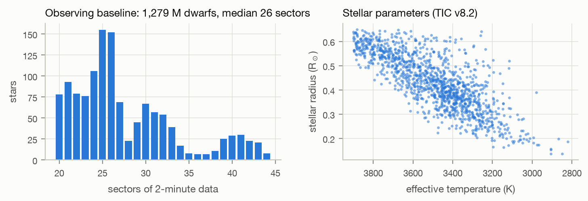

# 1. Data and search

This chapter describes the stars that were searched, how their light curves were prepared, and how
periodic transit signals were found. Vetting (Chapter 2) and everything after it operate on the
detections produced here.

## 1.1 Sample

The search targets the M dwarfs that NASA's Transiting Exoplanet Survey Satellite (TESS) has observed
for the longest. An Earth-sized planet blocks about 0.008% of a Sun-like star's light but about 0.1% of
a 0.3 R☉ M dwarf's, so small stars are where small planets are easiest to see. Stars near the ecliptic
poles fall in TESS's continuous viewing zones and have been re-observed for years, which accumulates
hundreds to thousands of transits for short orbits and makes Earth-sized signals detectable.

Candidates for the sample were drawn from every Science Processing Operations Center (SPOC) 2-minute
light curve released for Sectors 1–107: **1,735,111 light-curve files of 592,592 stars**, parsed from
MAST's per-sector download lists (`scripts/01_select_targets.py`). Sectors were counted per star, the
TESS Input Catalog (TIC v8.2) was queried for the 15,737 stars with at least 15 sectors, and a star was
kept if it satisfied all of:

| criterion | value | reason |
|---|---|---|
| sectors of 2-minute data | ≥ 20 | long baselines; many transits per orbit |
| effective temperature | ≤ 3,900 K | approximately the M spectral class |
| stellar radius | ≤ 0.65 R☉ | excludes evolved and K-type stars |
| TESS magnitude | ≤ 13.5 | photometric precision |
| luminosity class | dwarf | main-sequence stars only |
| TIC contamination ratio | ≤ 0.2 | limits dilution by neighbours |
| TIC disposition | none | removes catalogue duplicates and artefacts |

The selection yields **1,279 M dwarfs** with 20–44 sectors each (median 26), 2,821–3,900 K (median
3,473 K), 0.14–0.65 R☉ (median 0.43 R☉) and T = 8.1–13.5.

*Figure 1. Observing baseline (left) and TIC stellar parameters (right) of the 1,279 searched stars.*

NASA's most recent combined multi-sector search of these stars (SPOC, Sectors 1–96) predates Sectors
97–107; this search uses all of them.

## 1.2 Light-curve preparation

For each star every sector's SPOC light curve is downloaded, the columns the search needs are kept in one
compressed file per star (`tess_search/download.py`), and the light curve is prepared as follows
(`tess_search/lightcurve.py`):

1. **Quality.** Only cadences with `QUALITY = 0` and finite PDCSAP flux and error are used.
2. **Normalisation.** Each sector is divided by its median (PDCSAP and SAP separately).
3. **Flare removal.** M dwarfs flare frequently, and a flare's fast rise and slow decay can pull the
   detrending curve upward and create an artificial dip beside it. A running median (0.25 d) defines the
   local level; cadences more than 3σ above it in runs of two or more, or more than 5σ above it singly,
   are removed together with the following 10 contiguous cadences (20 minutes) of decay. Transits are
   dips and are never removed by this step.
4. **Detrending.** A robust sliding biweight filter (`wotan`, Hippke et al. 2019) with a 0.5-day window
   removes starspot modulation and instrumental drifts. The window is several times longer than any
   transit searched for. For strongly spotted fast rotators (Lomb–Scargle peak power > 0.3, peak-to-peak
   variability > 0.3%), the window is shortened to P_rot/6, but never below 0.3 d, so that rotation does
   not leak into the search.
5. **Outlier clip.** Single points more than 15σ below the median (cosmic rays, momentary pointing
   glitches) are removed; 15σ is far deeper than any per-cadence planetary signal at these precisions.
6. **Seasons.** The time series is split wherever there is a gap longer than 40 days. Each run of
   contiguous sectors (usually up to one observing year) is a *season*.

The stellar rotation period used in step 4 comes from a Lomb–Scargle periodogram of 30-minute bins,
computed per sector over 2.4 h to 13 d; the sector with the median peak power supplies the period. It is
stored and later used to flag signals at the rotation period.

## 1.3 Transit search

### Stacked seasonal box least squares

Eight years of data with year-long gaps make a single coherent box-least-squares (BLS) search
expensive: keeping transit phase aligned over the whole ~2,700-day baseline needs roughly ten times the
trial periods of a single season (of order a million per star), each evaluated on hundreds of thousands
of points. The search instead runs BLS (Kovács et al. 2002, `astropy`)
separately on each season, on one shared period grid, and **adds the seasons' log-likelihoods**:

$$\ln \mathcal{L}(P) = \sum_{s \in \text{seasons}} \max_{t_0,\,D} \ln \mathcal{L}_s(P, t_0, D).$$

A real planet raises the likelihood at its period in every season, so the sum grows with the number of
seasons; noise peaks land at different periods in different seasons and average out. Because BLS with
per-point errors gives $\ln\mathcal{L} = \tfrac{1}{2}\,\mathrm{SNR}^2$ for the best box, the stacked
value converts to an incoherent signal-to-noise ratio $\sqrt{2\ln\mathcal{L}}$.

Details:

* **Binning.** Each season is binned to 10-minute bins before BLS; per-bin errors come from the
  point-to-point scatter of that season. Seasons with fewer than 500 points are skipped, and a period
  contributes from a season only if the season spans at least two cycles of it.
* **Period grid.** Frequencies are spaced following Ofir (2014) for the star's TIC radius and mass, so
  that over a season the predicted transit time never drifts by more than a fraction of the expected
  transit duration (oversampling 3). Periods run from 0.4 to 40 days.
* **Durations.** Only physically plausible transit durations are tried in each period range: 0.5–1.4 h
  below 2 d, 0.75–2.8 h for 2–10 d, and 1.0–4.0 h above 10 d (M-dwarf central transits last about
  0.5–1.3 h at 1 d and 1.9–4.5 h at 40 d).
* **Only dips count.** Trial boxes with a positive (brightening) depth are given zero likelihood.
* **Detection statistic.** The stacked periodogram is converted to a signal detection efficiency (SDE):
  the peak height above a running median baseline, in units of the robust scatter of the periodogram.

### Coherent refinement

Each periodogram peak is refined by a coherent BLS on all data together, over ±30 coherent peak widths
around the seasonal period with a step of $P \cdot D_{\min} / (5\,T_{\rm span})$ and ten-fold phase
oversampling. This pins the period down to ~10⁻⁶ d for short orbits and yields the epoch, duration,
depth, depth error and a coherent box SNR.

### Iteration

After each detection its transits are masked (a window of twice the transit duration, centred on each
transit) and the search repeats, up to five
signals per star, so that multi-planet systems are found. The loop stops when the strongest remaining
peak falls below SDE = 7 or a refined signal falls below SNR = 7. These thresholds are deliberately
loose; vetting decides what survives.

### Throughput

The full search of 1,279 stars took about 4.5 hours on a fanless MacBook Air (Apple M2, three to four
worker processes, median 33 s per star) under a thermal guard that pauses work at the operating system's
"serious" thermal-pressure level (`tools/thermal/`). It produced **1,560 periodic signals**, of which
**1,139** had SNR ≥ 6 and were vetted.

## 1.4 Crossmatch with known signals

Every vetted signal is compared with five public lists (`tess_search/crossmatch.py`,
downloaded by `scripts/03_catalogs.py`):

| list | source |
|---|---|
| TESS Objects of Interest (TOIs) | ExoFOP-TESS |
| Community TOIs (CTOIs) | ExoFOP-TESS |
| confirmed planets | NASA Exoplanet Archive (`pscomppars`) |
| TESS eclipsing binaries | Prša et al. (2022), VizieR J/ApJS/258/16 |
| SPOC Threshold Crossing Events | all 132 single- and multi-sector SPOC data-validation runs |

A detection matches a known signal on the same star if the two periods agree within 0.3%, or stand in a
simple ratio (1:2, 2:1, 1:3, 3:1, 2:3, 3:2) within 0.3%, since pipelines often report half or double the
true period. The SPOC TCE lists matter: they contain every signal NASA's pipeline detected, including
those its human vetting team never promoted to TOIs. A signal is labelled *new* only if it matches
nothing in any list; *SPOC TCE only* if it matches a TCE but no TOI, CTOI or confirmed planet.

## References

* Hippke, M., David, T. J., Mulders, G. D., & Heller, R. 2019, AJ, 158, 143 (`wotan`)
* Kovács, G., Zucker, S., & Mazeh, T. 2002, A&A, 391, 369 (BLS)
* Ofir, A. 2014, A&A, 561, A138 (period grid)
* Prša, A., et al. 2022, ApJS, 258, 16 (TESS eclipsing binaries)
* Stassun, K. G., et al. 2019, AJ, 158, 138 (TIC v8)
