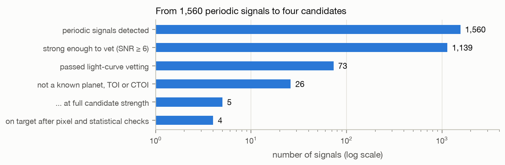

# 2. Vetting

Most periodic dips in TESS light curves are not planets. This chapter defines the automated tests that
separate planet-like signals from eclipsing binaries, light from neighbouring stars, instrumental
artefacts and stellar variability (`tess_search/vetting.py`), and reports what they did to the 1,139
vetted signals. The tests follow the logic of the Kepler Robovetter (Thompson et al. 2018) and recent
TESS vetters such as LEO-Vetter (Kunimoto et al. 2025), simplified and documented in code.

## 2.1 Correlated noise

TESS light curves, centroids and backgrounds carry correlated ("red") noise: slow wobbles from pointing
jitter, momentum dumps and scattered light. Error bars computed as if each 2-minute point were
independent are far too small, and every test then fires on noise; an early version of the centroid
test flagged TOI-700 d, a confirmed planet, at 20σ. Two mechanisms make the tests robust:

* **Noise at the transit's own timescale.** Flux tests use the robust scatter of light-curve means
  taken over windows as long as the transit core (0.8 × T₁₄), measured out of transit. This includes
  red noise by construction. Its ratio to the white-noise expectation is recorded as β.
* **Null calibration.** Centroid and background statistics are recomputed at 24 fake transit epochs
  (random phases away from the transit and from phase 0.5). The real statistic must stand out from that
  empirical distribution; the result is expressed as a robust z-score and an empirical p-value.

The folded light curve is also scanned with a box of the transit's width at every phase. Away from the
transit these box SNRs should scatter with unit standard deviation; their measured scatter (the
red-noise factor) rescales every phase-based statistic, and the transit's own box SNR divided by it is
the **folded red-noise SNR**.

## 2.2 Measured quantities

For each signal the following are computed:

| quantity | definition |
|---|---|
| trapezoid fit | depth, total duration T₁₄, ingress fraction, centre offset, fitted to the binned fold |
| per-transit depths | each transit's core (|Δt| < 0.4 T₁₄) against local out-of-transit flux (0.75–3 T₁₄), with timescale-noise errors |
| SNR (red-noise aware) | weighted mean of per-transit depths over its error |
| odd/even | weighted mean depths of odd and even transits and their difference in σ |
| secondary | the strongest other box in the fold (SNR, phase, depth) and the depth at phase 0.5 |
| uniqueness | folded red-noise SNR minus the third-strongest feature in the fold |
| single-event share | largest single transit's share of the summed SNR² |
| depth consistency | χ²/dof of per-transit depths and the excess fractional scatter |
| halves | signal SNR in the first and second halves of the transits |
| implied radius | √depth × R⋆ |
| duration ratio | T₁₄ divided by the central-transit duration expected for the star (circular orbit) |
| centroid motion | in/out-of-transit flux-weighted centroid differences per sector, null-calibrated |
| background change | in/out-of-transit SPOC background, null-calibrated, signed |
| SAP depth | depth in pre-PDC flux, divided by the SPOC crowding factor |
| edge fraction | fraction of transits within 0.5 d of a data gap longer than 0.5 d |
| harmonics | proximity to the spacecraft orbit (13.7 d), sector (27.4 d) and stellar rotation, × ½, 1, 2 |

## 2.3 Tests and thresholds

A test either **rejects** a signal (false positive) or **flags** it (a caution that prevents the
*candidate* verdict). A missing test never counts as a pass.

| impostor | test | rejects when | flags when |
|---|---|---|---|
| eclipsing binary | odd/even depths | difference > 3σ | |
| | dip at phase 0.5 | > 4σ and > 10% of the primary depth | |
| | other dip anywhere in the fold | > 5σ and > 10% of the primary depth | |
| | implied radius | > 20 R⊕ | |
| | V shape | SNR > 20 and ingress fraction > 0.4 | |
| light from a neighbour | centroid motion | z > 5, p ≤ 1/25 and implied source > 30″ away | z > 4 and source > 15″ |
| | duration vs. stellar density | T₁₄ > 3 × expected | > 2 × expected |
| instrumental artefact | transits observed | fewer than 3 | |
| | single-event share | one transit > 50% of the signal | |
| | data-gap pile-up | > 50% of transits beside gaps | |
| | duty cycle | dip fills > 15% of the orbit | |
| | spacecraft periods | within 3% of 13.7 d or 27.4 d × ½, 1, 2 | |
| | background in transit | | rises at z > 6, p ≤ 1/25 |
| | half-data consistency | | SNR > 9 overall but < 1.5 in one half |
| | per-transit depths | | χ²/dof > 3 and scatter > 30% of the depth |
| noise / variability | folded red-noise SNR | < 5 | 5–7, or not computable |
| | uniqueness | | < 2 |
| | rotation harmonics | within 3% of P_rot × ½, 1, 2 (clearly spotted star) and SNR < 15 | same, SNR ≥ 15 |

Three details are deliberate. Only ½, 1 and 2 times the spacecraft orbit are treated as systematics:
in the injection test, rejecting ⅓ and ¼ of the orbit removed real injected planets without matching
any known TESS systematic. The spacecraft window is 3% because TESS's orbit drifts by a few percent over
the mission. And a background *dip* during transit is expected for bright stars whose wings leak into
the background pixels, so only a background *rise* is flagged.

## 2.4 Verdicts

| verdict | rule |
|---|---|
| false positive | any rejecting test fires |
| candidate | red-noise-aware SNR ≥ 7.3 (Kepler's TCE threshold), folded red-noise SNR ≥ 7, no flags |
| weak candidate | SNR ≥ 6, otherwise |
| below threshold | SNR < 6 |

Some rules were refined while the search ran (for example, the spacecraft-period window and the
treatment of an untestable red-noise statistic). Every stored result was re-classified with the final
rules (`scripts/06_summarize.py`), so all stars are judged alike.

## 2.5 Outcome

| verdict | signals |
|---|---|
| false positive | 1,044 |
| candidate | 50 |
| weak candidate | 23 |
| below threshold | 22 |

The most frequent reasons for rejection (a signal can have several):

| reason | signals |
|---|---|
| dip lasts > 3× longer than a planet could take to cross the star | 531 |
| dip fills > 15% of the orbit | 480 |
| not distinct from other dips in the fold (folded red-noise SNR < 5) | 442 |
| period near the stellar rotation period or a harmonic | 437 |
| red-noise test could not be run (flag) | 403 |
| another dip in the fold nearly as strong (flag) | 346 |
| per-transit depths inconsistent (flag) | 315 |
| one transit carries most of the signal | 205 |
| odd/even depths differ | 160 |
| dip at phase 0.5 | 146 |

Of the 73 signals that passed, 47 match a known planet, TOI or CTOI, 3 match only a SPOC TCE that was
never promoted, and 23 match nothing. At full candidate strength the novel signals are **5**: two that
appear in no list and three SPOC TCEs. The other 21 novel signals are weak candidates (Chapter 7).

*Figure 2. Signals remaining after each stage, including the pixel-level and statistical checks of
Chapters 4 and 5.*

## 2.6 Behaviour on known signals

Of the 84 catalogued signals the search recovered on these stars (Chapter 3), vetting passed 76 and
rejected 8. The rejected ones include signals the TESS Follow-up Observing Program had already
classified as false positives, for example TOI-419.01 (a nearby eclipsing binary), TOI-1178.01 (a
V-shaped eclipse) and TOI-1635.01.

## 2.7 Follow-up of surviving novel signals

Every novel signal that passed (5 candidates, 21 weak candidates) was taken through a follow-up stage
(`scripts/08_followup.py`): a fresh vetting pass, a least-squares physical transit fit (`batman`,
stellar-density prior), an independent search of each half of the data near the candidate period, and
a census of Gaia DR3 neighbours within three TESS pixels with the eclipse depth each would need to
reproduce the signal. The per-signal results are in `results/followup/`. The deeper checks that follow
in Chapters 4 and 5 start from these.

## References

* Kunimoto, M., et al. 2025, AJ (LEO-Vetter)
* Thompson, S. E., et al. 2018, ApJS, 235, 38 (Kepler DR25 Robovetter)
