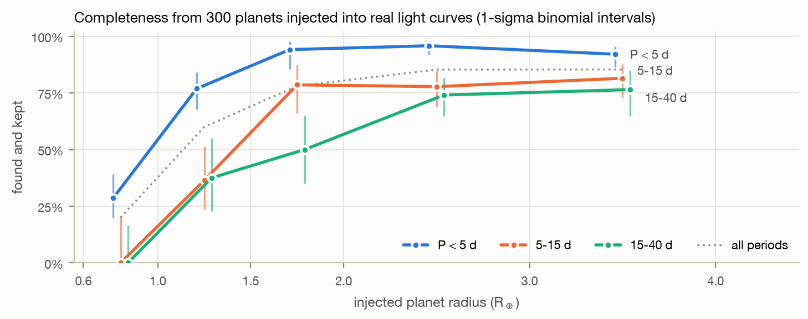

# 3. Sensitivity and reliability

A candidate list is only as meaningful as the search's measured ability to find real planets
(completeness) and to avoid inventing them (reliability). This chapter reports three measurements:
recovery of planets already known around the searched stars, recovery of synthetic planets injected
into the real light curves, and the false-alarm rate on light curves turned upside down.

## 3.1 Recovery of known signals

The searched stars host 97 catalogued signals with periods of 0.4–40 days: TOIs, CTOIs and confirmed
planets (`scripts/check_known.py`). The search recovered **84** of them independently. Of the 13 it
missed, 5 are confirmed planets discovered by radial velocity that do not transit (GJ 685 b, L 98-59 e
and f, TOI-1450 A c and G 261-6 b), which no transit search can detect, and one is a TFOP-designated
false alarm. The remaining seven misses are:

| star | signal | period (d) | disposition |
|---|---|---|---|
| TIC 198162530 | TOI-5738.01 | 0.7681 | PC |
| TIC 272466980 | CTOI-272466980.01 | 3.4561 | PC |
| TIC 321669174 | TOI-2081.02 | 5.1097 | PC |
| TIC 374829238 | TOI-785.01 | 18.6286 | PC |
| TIC 198162530 | TOI-5738.02 | 28.5462 | PC |
| TIC 287139872 | TOI-1752.02 | 32.7135 | CP |
| TIC 287139872 | TOI-1752 c | 32.7144 | confirmed |

Counting confirmed transiting planets only, the search recovers **25 of 26**, the miss being TOI-1752 c
at 32.7 d. The recoveries include all four planets of **TOI-700** (b, c, d and e; d and e are
Earth-sized and in or near the habitable zone), **L 98-59** b, c and d, and ultra-short-period planets
such as TOI-6000 b (0.449 d) and TOI-1442 b (0.409 d). Vetting passed 76 of the 84 recovered signals;
the 8 it rejected include signals TFOP had already classified as false positives (Chapter 2).

## 3.2 Injection–recovery

### Design

300 synthetic transits were planted into the **raw** PDCSAP and SAP fluxes of randomly chosen searched
stars that host no known planet, TOI, CTOI or catalogued eclipsing binary
(`scripts/05_reliability.py inject`). Each is a physical `batman` model (Kreidberg 2015) with quadratic
limb darkening typical of M dwarfs in the TESS band (u₁ = 0.20, u₂ = 0.40), drawn from

| parameter | distribution |
|---|---|
| planet radius | uniform, 0.6–4.0 R⊕ |
| period | log-uniform, 0.5–40 d |
| impact parameter | uniform, 0–0.9 |
| phase | uniform |

The injected light curve then goes through every step of the real pipeline (cleaning, detrending,
search, vetting), so each injected planet suffers everything a real one would. An injection is
**detected** if a detection lies within 0.5% of its period with an epoch within 0.1 d, and **kept** if
that detection is then classified as a candidate or weak candidate.

### Results

* detected: **79.7%**; detected and kept: **74.0%**; vetting kept 92.9% of detected planets.
* Of the 17 detected-then-rejected injections, 14 fell within 3% of a spacecraft period (½, 1 or 2 × the
  13.7-day orbit), which the vetting rejects on purpose; the other 3 failed the transit-count, fold
  distinctness and odd/even tests once each.
* Planets of 2–4 R⊕ inside 15 days: **88.6%** kept. Planets under 1.5 R⊕ inside 5 days: **55.3%**.

Found-and-kept fraction by injected radius and period (number injected in parentheses):

| radius (R⊕) | P < 5 d | 5–15 d | 15–40 d | all |
|---|---|---|---|---|
| 0.6–1.0 | 29% (21) | 0% (4) | 0% (5) | 20% (30) |
| 1.0–1.5 | 77% (26) | 36% (11) | 38% (8) | 60% (45) |
| 1.5–2.0 | 94% (17) | 79% (14) | 50% (10) | 78% (41) |
| 2.0–3.0 | 96% (48) | 78% (27) | 74% (27) | 85% (102) |
| 3.0–4.0 | 92% (38) | 81% (27) | 76% (17) | 85% (82) |

*Figure 3. Completeness as a function of planet radius in three period ranges.*

The search is sensitive to Earth-sized planets on short orbits, which is where all four candidates lie,
and loses sensitivity below 1 R⊕ and towards long periods, where few transits are observed. With 300
injections the cells hold 4–48 planets each, so individual cell values carry binomial uncertainties of
up to ±20%.

## 3.3 Reliability: inverted light curves

### Design

200 light curves (each searched star used at most once, again excluding known hosts) were flipped about
their per-sector median before any cleaning, so that every dip becomes a bump and every bump a dip, and
then run through the identical pipeline (`scripts/05_reliability.py invert`). No planet can survive the
flip, so anything that passes vetting is a false alarm produced by noise and systematics with the same
statistical character as the real data. One asymmetry makes the test conservative: stellar flares become
dips in the inverted data and are no longer removed by the flare filter, which only clips upward
outliers.

### Results

* **False candidates: 0** in 200 stars. With none observed, the 95% upper limit is 3/200 = **1.5%** of
  stars, or fewer than ~19 expected among 1,279; the best estimate is close to none.
* **False weak candidates:** on 6 of 200 stars (**3.0%**), i.e. ~38 expected among the searched stars,
  against 23 weak candidates found in the real search. Weak candidates are therefore mostly false
  alarms, and are reported separately (Chapter 7).

## 3.4 What a candidate verdict means

Together these measurements say that a candidate from this pipeline is unlikely to be a statistical
fluctuation (no false candidates from inverted data), and that for short-period Earth-sized planets the
search finds most of what is there. They say nothing about *astrophysical* false positives that produce
real, planet-shaped dips: eclipsing binaries diluted by a brighter target, or neighbouring stars whose
eclipses leak into the aperture. Those require looking at the pixels and weighing the alternatives
statistically, which is the subject of Chapters 4 and 5.

## References

* Kreidberg, L. 2015, PASP, 127, 1161 (`batman`)
