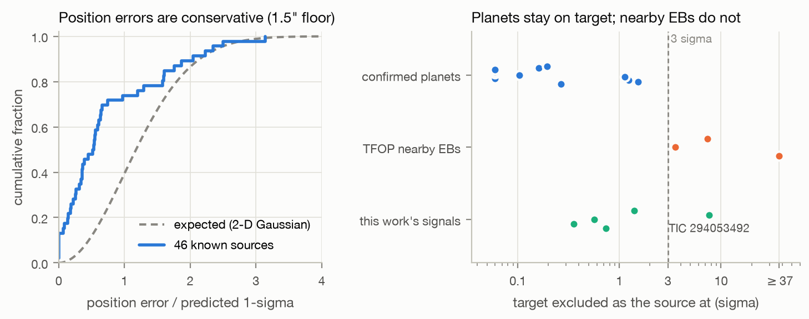
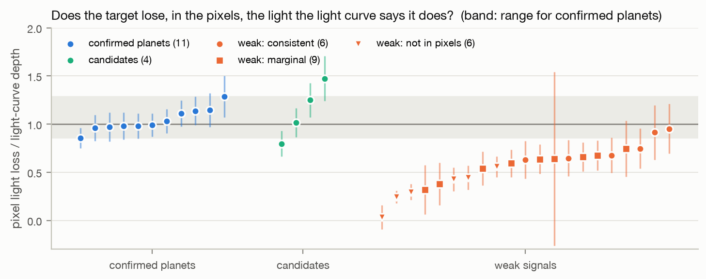

# 4. Pixel-level localization

A light curve records the total light in a small aperture. TESS pixels are 21″ across, so several stars
usually share that aperture, and an eclipsing binary a few pixels away can leak a planet-sized dip into
the target's light curve. The light curve cannot distinguish the two cases; the pixels can, because each
star spreads its light over the detector in a known pattern centred on its own position. This chapter
describes a method that measures *where on the sky* the light goes missing during transit, how its
errors were calibrated, and how it performed on cases whose answer is known
(`tess_search/localize.py`, `scripts/12_localize.py`).

## 4.1 Data

For every signal localized, all SPOC target pixel files (TPFs) of the star are used: 20–42 sectors per
star, typically 11 × 11-pixel stamps at 2-minute cadence (about 47 MB per sector; 44 GB in total for the
candidates, the test stars and the weak signals). Only cadences with `QUALITY = 0` and finite flux in
every pixel are kept. Flares are removed per sector by running the light-curve flare detector (Chapter 1)
on the summed aperture flux; a flare inside an in-transit window would otherwise appear as a strongly
negative difference image that no dimming source can explain.

## 4.2 Where each star falls on the pixels

Each sector is calibrated independently.

* **Stars.** All Gaia DR3 sources (Gaia Collaboration 2023) within 150″ and brighter than G = 21 are
  retrieved from VizieR (I/355/gaiadr3). Their positions are moved from the Gaia epoch (2016.0) to the
  sector's mid-time with their proper motions, which matters for nearby M dwarfs moving up to several
  arcseconds over the mission. TESS magnitudes come from G and BP − RP (Stassun et al. 2019), and
  fluxes from the TESS zero point (15,000 e⁻ s⁻¹ at T = 10).
* **Pixel response.** The SPOC pixel response function (PRF) models for the sector's camera and CCD are
  interpolated to the stamp's detector position (`TESS_PRF`, Bell & Higgins 2022), giving, for any
  sub-pixel location, the fraction of a point source's light in each stamp pixel.
* **Image fit.** The median image of the sector is fitted as the sum of every star's PRF scaled by its
  catalogue flux, with four free parameters: a shared pixel shift (Δx, Δy), a flux scale and a constant
  background. The shift absorbs the small errors of the TPF's world coordinate system. Typical fitted
  shifts are below 0.07 pixel (1.5″). Stamps whose model residual exceeds 50% of the image flux are
  skipped.

## 4.3 Difference images

For a signal with period P, epoch t₀ and duration T₁₄, every transit event in a sector gives a
difference image

$$\Delta_e = \tfrac{1}{2}\left(\bar F_{\rm before} + \bar F_{\rm after}\right) - \bar F_{\rm in},$$

where $\bar F_{\rm in}$ averages the cadences of the transit core (|t − t_c| < 0.4 T₁₄) and
$\bar F_{\rm before}$, $\bar F_{\rm after}$ average windows of width max(T₁₄, 1 h) beginning 0.75 T₁₄
before and after the centre. Averaging both sides cancels slow linear drifts. Positive pixels lost light
during transit. An event is used only if it has at least max(3, half the expected) in-transit cadences
and at least three cadences on each side; events whose summed in-aperture change is a > 5 MAD outlier
among the sector's events (residual flares, glitches) are dropped. The sector's difference image is the
mean of its events.

**Per-pixel uncertainties** come from *null events*: the same measurement repeated at up to 60 random
times per sector whose windows do not touch any transit. The robust scatter of the null images is the
noise of a single event at the transit's own timescale, including red noise and pointing jitter; the
error of the sector mean is that scatter divided by √n_events. This works for long periods with only one
or two transits per sector, where scatter between transits cannot be measured.

## 4.4 Joint fit of the source position

All sectors are fitted together. For a trial sky position the model of sector s's difference image is

$$\Delta_s = A\,\mathrm{PRF}_s(x_s, y_s) + c_s ,$$

with one light-loss amplitude A (e⁻ s⁻¹) shared by all sectors, because a star loses the same light in
every sector, and a per-sector constant c_s for any background change. (x_s, y_s) is the trial position
mapped into sector s's pixels, including that sector's calibrated shift. A and the c_s enter linearly
and are solved in closed form, so each trial position costs one χ² evaluation summed over all pixels of
all sectors.

Trial positions are offsets east and north of the target, **co-moving with the target**, so a
high-proper-motion host stays at the origin in every sector. They are scanned on a 5″ grid out to ±100″,
then on a 1″ grid around the minimum. In addition each Gaia star is evaluated along its own
proper-motion track. The best χ² of the grid and the stars is the reference, and

$$\Delta\chi^2_k = \frac{\chi^2_k - \chi^2_{\min}}{\max(\chi^2_\nu, 1)}$$

measures how strongly position k (or star k) is excluded, with the errors inflated whenever the fit's
reduced χ² exceeds one. The statistical 68% region is the area where Δχ² < 2.30 (two parameters).

## 4.5 Systematic error floor

The PRF models and the sky-to-pixel calibration are not perfect, so a position error floor is added in
quadrature: for a statistical one-dimensional error σ_stat and floor σ_sys,

$$\Delta\chi^2_{\rm eff} = \Delta\chi^2\,\frac{\sigma_{\rm stat}^2}{\sigma_{\rm stat}^2 + \sigma_{\rm sys}^2},$$

and exclusion significances are the two-sided Gaussian equivalents of Δχ²_eff for two degrees of freedom.

The floor was measured, not assumed. Among the validation runs below there are 46 cases whose true source
is known (confirmed planets on their host, and synthetic eclipses planted at known positions). A floor of
0.59″ makes their mean squared normalized miss equal to the two-dimensional expectation; a floor of 1.4″
is the smallest for which 95% of them fall inside their 2σ region. **1.5″ is adopted.** With it the
position errors are conservative: the known sources sit closer to their true positions than the errors
predict (Figure 4, left).

## 4.6 Validation

### Confirmed planets and known false positives

Every confirmed planet tested comes out on its own host, and every signal that TFOP had traced to a
nearby eclipsing binary comes out off target:

| test case | signal | sectors | offset from target | target excluded at | reduced χ² |
|---|---|---|---|---|---|
| confirmed planet | L 98-59 b | 27 | 1.0 ± 2.3″ | 0.2σ | 1.28 |
| | L 98-59 c | 27 | 0.0 ± 2.3″ | 0.0σ | 1.19 |
| | L 98-59 d | 27 | 0.0 ± 2.3″ | 0.0σ | 1.15 |
| | TOI-700 b | 37 | 4.1 ± 3.4″ | 1.1σ | 1.28 |
| | TOI-700 c | 30 | 0.0 ± 2.3″ | 0.0σ | 1.20 |
| | TOI-700 d | 22 | 1.0 ± 3.4″ | 0.1σ | 1.26 |
| | TOI-1756 b | 20 | 3.2 ± 2.7″ | 1.2σ | 1.20 |
| | TOI-2084 b | 33 | 1.0 ± 2.7″ | 0.2σ | 1.11 |
| | TOI-2094 b | 34 | 0.0 ± 2.9″ | 0.0σ | 1.03 |
| | TOI-5728 b | 30 | 1.4 ± 3.3″ | 0.3σ | 1.21 |
| | TOI-6000 b | 33 | 4.5 ± 2.9″ | 1.5σ | 1.01 |
| TFOP nearby EB | TOI-419.01 | 32 | 26.8 ± 2.3″ | > 37σ | 1.52 |
| | TOI-2084.02 | 33 | 13.0 ± 2.5″ | 7.4σ | 1.12 |
| | TOI-2283.01 | 42 | 28.5 ± 6.2″ | 3.5σ | 1.39 |

The off-target cases also land on plausible sources. TOI-2084.02 coincides with a T = 18.2 star 14″
east of the target that would need a 24% eclipse. TOI-2283.01 points 28″ to the north-north-west,
where TFOP's own note reads "possible offset towards another star to the north", and coincides with a
T = 14.5 star there. TOI-419.01, which TFOP retired with the note "may be on TIC 279251647", localizes
onto a fainter T = 16.5 star (Gaia DR3 5480636006390944000) 21″ from the target that would need a 17%
eclipse; TIC 279251647 itself lies 11.8″ from the best position and is excluded at 24σ. Separating two
sources 12″ apart is well within the method's resolution, so this result suggests a different host for
TOI-419.01's eclipses than the one TFOP tentatively named.

*Figure 4. Left: distribution of position errors of 46 sources of known position, normalized by the
predicted error (1.5″ floor included), against the two-dimensional Gaussian expectation. Right: how
strongly the target is excluded as the source, for confirmed planets, TFOP nearby eclipsing binaries
and this work's five signals.*

### Synthetic eclipses in the real pixels

For each candidate star, and for one confirmed-planet star of each test system, synthetic eclipses were
planted into the real pixel data: once on the target, and once on each of up to three neighbours that
could most easily mimic the signal, with the eclipse depth chosen so that the diluted dip in the
target's aperture equals the observed depth (required neighbour eclipse depths 0.1–32%). A box-shaped
eclipse of the neighbour's PRF, scaled to the required light loss, is subtracted from every in-eclipse
cadence at a period of 1.3713 × the signal's period, so it does not coincide with the real transits.

* 39 eclipses were planted (12 on targets, 27 on neighbours 4.7–83″ away).
* 35 fits are reliable (reduced χ² < 2). Of these, **34 are attributed to the correct star**.
* For 22 of the 24 reliable neighbour injections, the target is excluded at more than 3σ. The two
  exceptions are faint neighbours 13–16″ away that would need 3% and 28% eclipses; there the target is
  excluded at 2.7–2.8σ.
* The one misattribution is the target injection on TIC 198412174, assigned to a T = 18.2 star 4.7″ from
  the target: two sources that close are below the method's resolution.

### A failure mode, and how it is flagged

The four injections around TOI-6000 returned poor fits (reduced χ² 3.4–3.5), and the one on the target
was localized 126″ away. Inspecting the difference images showed why: a bright neighbour in the stamp is
a variable star whose brightness happens to vary coherently at the injected period (1.3713 × 0.449 d),
appearing as a ±10σ signal of alternating sign from sector to sector. The model assumes a single source
changes brightness in step with the transit ephemeris; a second, commensurate variable breaks that
assumption. Because the failure shows up as a poor fit, every localization with reduced χ² ≥ 2 is
flagged unreliable. All four flagged runs are TOI-6000 injections; the real TOI-6000 b signal, at a
non-commensurate period, fits normally (reduced χ² 1.01) and localizes on target. No candidate is
affected (reduced χ² 1.06–1.16).

## 4.7 Second test: is the light loss the right size?

Localization asks where the light goes; a complementary test asks how much. If the target hosts a
transit of depth δ and its total flux is F⋆, it must lose δF⋆ in the difference images. The ratio

$$r = \frac{A_{\rm target}}{\delta\,F_\star}$$

of the amplitude fitted at the target's position to that prediction is about one for a real on-target
transit, and near zero for a dip that exists in the processed light curve but not in the pixels (a
light-curve artefact). Across the 11 confirmed planets r spans 0.85–1.29 (standard deviation 0.12);
that scatter, which reflects aperture and crowding corrections, is added to every ratio's error.

*Figure 5. Pixel-to-light-curve depth ratio for confirmed planets, the four candidates and the 21 weak
signals (Chapter 7). The band is the range spanned by confirmed planets.*

All four candidates are consistent with one (0.80 ± 0.13 to 1.47 ± 0.23) and are detected in the pixels
at 8.7–13σ. The weak signals behave differently: six fall more than 3σ below one, i.e. their
light-curve dips are not reproduced in the pixels (Chapter 7).

## 4.8 Results for this work's signals

| signal | sectors | transits | offset from target | target excluded at | nearest neighbour excluded at | depth ratio | reduced χ² |
|---|---|---|---|---|---|---|---|
| TOI-218 (TIC 32090583) | 41 | 428 | 2.2 ± 3.0″ | 0.6σ | 4.5σ (13.5″, wide-binary companion) | 1.25 ± 0.18 | 1.08 |
| TIC 229689348 | 25 | 1,138 | 3.6 ± 3.3″ | 0.7σ | 4.6σ (9.2″) | 1.02 ± 0.15 | 1.12 |
| TIC 149390648 | 32 | 234 | 4.2 ± 3.6″ | 1.4σ | all > 3σ | 1.47 ± 0.23 | 1.06 |
| TIC 198412174 | 37 | 546 | 2.2 ± 3.5″ | 0.4σ | 1.3σ (4.7″, T = 18.2) | 0.80 ± 0.13 | 1.16 |
| TIC 294053492 | 21 | 419 | **21.6 ± 3.1″** | **7.7σ** | source on a G = 19.8 star | – | 1.11 |

Each candidate was also localized from the odd-numbered and even-numbered sectors separately. The four
on-target signals stay on target in both halves (target excluded at ≤ 1.8σ in every half); TIC 294053492
is off target in both halves independently (6.1σ and 6.8σ).

*Figure 6. Where the light goes missing. Shading shows how strongly each position is excluded as the
source (dark: allowed); the dashed contour is the 3σ region. Circles are Gaia DR3 stars sized by
brightness, + the target and × the best-fit source position.*

The same method shows that all three signals in the TOI-218 system come from TIC 32090583 and not its
equal-brightness wide-binary companion 13.5″ away: the companion is excluded at 8.7σ for TOI-218.01,
6.8σ for TOI-218.02 and 4.5σ for the new signal.

## 4.9 Comparison with SPOC's difference-image centroids

NASA's SPOC Data Validation (Twicken et al. 2018) also fits difference images, one sector at a time,
and reports a multi-sector mean centroid offset. For the three candidates that were SPOC TCEs, the
relevant DV reports were retrieved from MAST and parsed (`tess_search/spoc_dv.py`). In all five relevant
runs, none of the 135 per-sector difference images passed SPOC's own quality metric, and in two runs
SPOC's period was far enough off to smear the transit (Chapter 5). The 55″ offset SPOC reported for TIC
229689348 in its Sectors 14–55 run is therefore not a reliable localization; the joint fit here, at the
correct period with all 25 sectors, places the source on the target and excludes the bright star 48.7″
away that the SPOC offset points towards at 8.0σ.

## References

* Bell, K. J., & Higgins, M. E. 2022, `TESS_PRF` (Astrophysics Source Code Library)
* Gaia Collaboration, Vallenari, A., et al. 2023, A&A, 674, A1
* Stassun, K. G., et al. 2019, AJ, 158, 138
* Twicken, J. D., et al. 2018, PASP, 130, 064502 (SPOC Data Validation)
