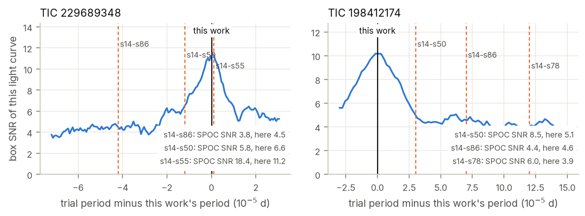
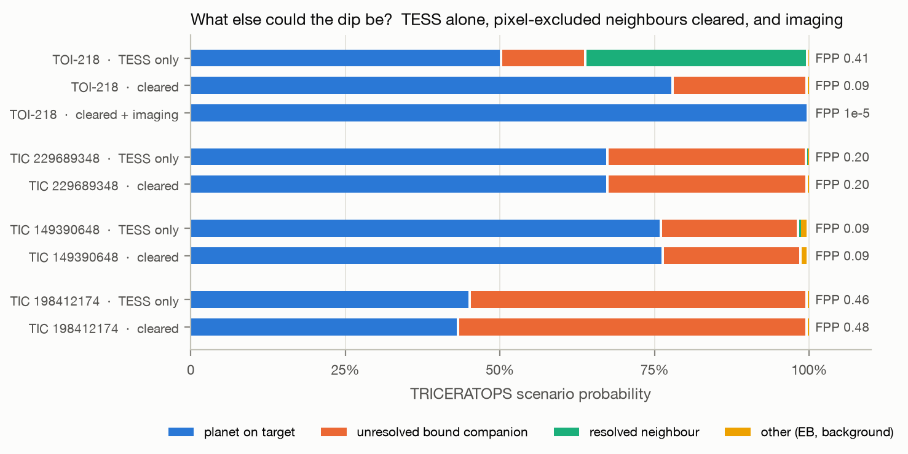

# 5. Transit fits and false-positive probabilities

This chapter covers the physical transit fits that give each candidate's size and orbit, the comparison
with NASA's own pipeline for the candidates it had flagged, and the statistical weighing of planet and
false-positive scenarios with TRICERATOPS.

## 5.1 Transit model

Each signal is fitted with a Mandel–Agol transit model (`batman`, Kreidberg 2015) sampled with `emcee`
(Foreman-Mackey et al. 2013) (`tess_search/mcmc.py`, `scripts/14_mcmc.py`).

**Data.** The light curve is detrended again with the transits masked: the biweight trend is fitted to
points more than 1.5 T₁₄ from any transit and interpolated across the transits. The search's own
detrending sees the in-transit points and, for deep or long transits, sags slightly into them, making
transits shallower and more V-shaped (see 5.2). The detrended light curve is folded at the period and
binned to 1 minute within ±3 T₁₄. Each bin's error is the out-of-transit point scatter divided by √n,
multiplied by the red-noise factor β measured at the transit timescale (β = 1.00–1.16 for the
candidates). The model is integrated over 2.5 minutes to match 1-minute bins of 2-minute cadences.

**Parameters and priors.**

| parameter | prior |
|---|---|
| mid-transit offset | uniform within ±T₁₄/2 |
| radius ratio k = R_p/R⋆ | uniform, 0.001–0.3 |
| impact parameter b | uniform, 0 to 1 + k (grazing allowed) |
| stellar density ρ⋆ | Gaussian, ρ_TIC ± σ (sampled in log ρ⋆) |
| limb darkening u₁, u₂ | Gaussian, 0.20 ± 0.10 and 0.40 ± 0.10, restricted to physical values |

The density prior comes from the TIC mass and radius, ρ_TIC = M/R³ × ρ☉, with the TIC's 3% radius error
and an assumed 5% mass error for the Mann et al. (2019) mass–luminosity relation, giving σ/ρ ≈ 10%. With
the period fixed, ρ⋆ sets a/R⋆ through Kepler's third law, $a/R_\star = (G\rho_\star P^2/3\pi)^{1/3}$, and
breaks the degeneracy between b and a/R⋆ that otherwise dominates low-SNR fits.

**Sampling.** 32 walkers, 6,000 steps, the first 2,000 discarded. Integrated autocorrelation times are
66–77 steps for the candidates, so the retained chains are 52–61 autocorrelation times long (convergence
is required at > 30). Each posterior sample is converted to physical quantities with the stellar radius drawn
from its TIC uncertainty, so the planet radius carries the stellar-radius error:

$$R_p = k\,R_\star,\qquad a = (a/R_\star)\,R_\star,\qquad T_{\rm eq} = T_{\rm eff}\sqrt{R_\star/2a},\qquad S = (R_\star/{\rm R_\odot})^2\,(T_{\rm eff}/5772\,{\rm K})^4\,/\,(a/{\rm AU})^2 .$$

T_eq assumes zero albedo and full heat redistribution; S is in units of Earth's insolation.

**A shape check.** Each signal is fitted a second time with a wide log-uniform prior on ρ⋆
(10^−1.5–10^2.5 g cm⁻³), so that the stellar density implied by the transit shape alone can be compared
with the TIC value. A transit on a much larger or smaller star (a blend), or on an eccentric orbit,
would pull it away from one. These chains mix slowly because b and ρ⋆ trade off almost perfectly at
these SNRs (autocorrelation times up to ~1,800 steps even with 30,000 steps), so they are reported as
indicative only.

## 5.2 Validation on published planets

The same fit was applied to two well-characterized planets around stars in the sample, with their
period and epoch first refined by a least-squares transit fit:

| planet | this work | published | difference |
|---|---|---|---|
| TOI-700 d | 1.18 ± 0.05 R⊕ | 1.073 +0.059/−0.054 R⊕ (Gilbert et al. 2023) | +1.4σ |
| L 98-59 c | 1.34 ± 0.04 R⊕ | 1.385 +0.095/−0.075 R⊕ (Demangeon et al. 2021) | −0.5σ |

TOI-700 d's insolation (0.87 S⊕) and equilibrium temperature (269 K) also agree with the literature.
Two lessons from this test shape how the candidate results should be read.

* **Detrending moves radii.** Without transit masking, TOI-700 d's fit gives 1.00 ± 0.05 R⊕; with it,
  1.18 ± 0.05 R⊕. A 0.5-day biweight window is only four times TOI-700 d's 3.2-hour transit, so the
  unmasked filter absorbs part of the dip. The candidates' transits are 0.5–1.1 hours long and their
  radii changed by only 1–4% between the two treatments, which is smaller than their statistical errors.
* **The shape check is weak.** For L 98-59 c (SNR 125) the free-density fit prefers a near-grazing
  geometry and 0.49 times the TIC density, although L 98-59 is a well-studied single M dwarf. The
  shape-only density is therefore treated as weak evidence in both directions.

## 5.3 Candidate parameters

Medians and 68% intervals of the adopted (density-prior) fits. Periods and their errors come from the
least-squares fit, inflated by β; T₀ is near the middle of each baseline.

| | TOI-218 (TIC 32090583) | TIC 229689348 | TIC 149390648 | TIC 198412174 |
|---|---|---|---|---|
| period (d) | 2.1467982 ± 0.0000019 | 0.4653769 ± 0.0000005 | 2.8368867 ± 0.0000038 | 1.3901602 ± 0.0000014 |
| T₀ (BJD_TDB) | 2459318.6971 ± 0.0010 | 2459027.6289 ± 0.0005 | 2459180.6342 ± 0.0015 | 2459644.3198 ± 0.0008 |
| timing σ on 2027 June 1 | 3.2 min | 3.7 min | 5.0 min | 3.0 min |
| depth (ppm) | 1273 ± 106 | 693 ± 65 | 798 ± 88 | 382 ± 43 |
| T₁₄ (h) | 0.93 ± 0.05 | 0.53 ± 0.02 | 1.14 ± 0.08 | 0.61 ± 0.04 |
| R_p/R⋆ | 0.0339 ± 0.0017 | 0.0266 ± 0.0014 | 0.0267 ± 0.0017 | 0.0216 ± 0.0016 |
| b | 0.51 ± 0.10 | 0.80 ± 0.03 | 0.51 ± 0.12 | 0.93 ± 0.01 |
| a/R⋆ | 15.8 ± 0.5 | 4.4 ± 0.2 | 16.9 ± 0.6 | 7.6 ± 0.3 |
| inclination (°) | 88.1 ± 0.4 | 79.6 ± 0.7 | 88.3 ± 0.4 | 83.0 ± 0.3 |
| **R_p (R⊕)** | **1.05 ± 0.06** | **1.25 ± 0.08** | **1.00 ± 0.07** | **1.35 ± 0.11** |
| a (AU) | 0.0209 ± 0.0009 | 0.0089 ± 0.0004 | 0.0271 ± 0.0013 | 0.0202 ± 0.0009 |
| T_eq (K) | 578 ± 30 | 1131 ± 56 | 581 ± 29 | 954 ± 44 |
| insolation (S⊕) | 19 ± 4 | 272 ± 54 | 19 ± 4 | 138 ± 25 |
| ρ⋆ shape-only / TIC | 1.1 +0.6/−0.8 | 3.1 +1.4/−2.0 | 0.8 +0.8/−0.8 | 6.8 +9.4/−6.6 |

All four are close to Earth's size (1.0–1.35 R⊕) on orbits of 11 hours to 2.8 days and far too hot to
be habitable. TIC 229689348 and TIC 198412174 have short transits for their periods, which the fit
explains with high impact parameters (b ≈ 0.80 and 0.93); their shape-only densities lean towards a
denser host, consistent within the large uncertainties with the target, and they matter for the
companion scenarios below.

*Figure 7. Phase-folded TESS photometry of the four candidates (8-minute bins) with the median transit
model.*

## 5.4 What NASA's pipeline saw

Three candidates (TIC 229689348, TIC 198412174, TIC 149390648) were SPOC Threshold Crossing Events that
never became TOIs. For two of them, the SNR SPOC reported fell as more data were added:

| star | SPOC run | SPOC period (d) | SPOC SNR | SNR of this light curve at SPOC's period | transit drift over baseline |
|---|---|---|---|---|---|
| TIC 229689348 | s14–s50 | 0.465365 | 5.8 | 6.6 | 1.2 h |
| | s14–s55 | 0.465378 | 18.4 | 11.2 | 0.1 h |
| | s14–s86 | 0.465335 | 3.8 | 4.5 | 4.2 h |
| TIC 198412174 | s14–s50 | 1.39019 | 8.5 | 5.1 | 1.0 h |
| | s14–s78 | 1.39028 | 6.0 | 3.9 | 4.1 h |
| | s14–s86 | 1.39023 | 4.4 | 4.6 | 2.4 h |
| TIC 149390648 | s1–s96 | 2.83687 | 8.5 | 8.6 | 0.4 h |

Folding this work's light curve at each SPOC period reproduces SPOC's drop (`scripts/11_spoc_period_check.py`).
A period error of a few 10⁻⁵ d, invisible over a single sector, accumulates over ~2,000 days and
thousands of orbits into hours of drift, smearing a sub-hour transit. At this work's period the same
light curves give box SNRs of 11.2 and 10.2. The signals did not fade; SPOC's period estimates moved.
The DV reports also show that none of SPOC's per-sector difference images for these runs passed its own
quality metric (Chapter 4).

*Figure 8. Box SNR of this work's light curves as a function of trial period, with the periods SPOC
adopted in each multi-sector run.*

## 5.5 Statistical validation with TRICERATOPS

### Configuration

TRICERATOPS (Giacalone et al. 2021) computes the probability of each scenario that could produce the
observed transit: a planet on the target (TP); an eclipsing binary on the target (EB, and EBx2P at twice
the period); a planet or eclipsing binary on an unresolved bound companion, either diluting a planet on
the target (PTP, PEB) or hosting the event itself (STP, SEB); unresolved foreground or background stars
(DTP, DEB, BTP, BEB); and resolved neighbouring stars (NTP, NEB). It combines priors from the stellar
population with the likelihood of the transit shape and the flux each star contributes to the aperture.
It reports

* FPP, the probability that the signal is not a planet on the target, and
* NFPP, the probability that it comes from a resolved neighbour.

Giacalone et al. (2021) call a candidate *validated* if FPP < 0.015 and NFPP < 0.001 (with
high-resolution imaging), and a *likely planet* if FPP < 0.5 and NFPP < 0.001.

Inputs (`scripts/13_triceratops_inputs.py`, `13_triceratops_run.py`, run in a separate environment
pinned to TRICERATOPS 1.1.0):

| input | value |
|---|---|
| light curve | PDCSAP, folded, 2-minute bins within ±3 T₁₄; one flux error (out-of-transit scatter of the bins) |
| depth, period | from the follow-up fit |
| apertures | SPOC photometric apertures of four sectors spread over each star's baseline |
| nearby stars | TIC within 10 pixels, via TRICERATOPS's own query |
| field population | Gaia DR3 within 0.1 deg² down to G = 21, converted to stellar properties with TRICERATOPS's own dwarf-sequence relations; queried through VizieR because the ESA Gaia archive did not respond during this work |
| draws, repeats | 10⁶ per run; 5 runs (TESS-only) or 3 runs (cleared), mean and scatter reported |
| imaging | none, except one additional TOI-218 run with its public speckle contrast curve (below) |

### Clearing neighbours with the pixel localization

TRICERATOPS uses brightness ratios and the transit shape but no pixel-level information, so it cannot
use the localization of Chapter 4. A second set of runs therefore treats every neighbour that the
localization excludes at more than 3σ as cleared, in the same way that stars cleared by ground-based
photometry are removed from consideration: the neighbour's required depth is set to zero, so TRICERATOPS
no longer considers it a possible host. TRICERATOPS stars (TIC entries) are matched to localization
stars (Gaia DR3) by sky offset within 4″ and TESS magnitude within 1.5 mag, after the Gaia positions
are moved to the TIC epoch (J2000) with their proper motions. (TOI-218 moves 0.24″ per year; without
that step two of its pixel-excluded neighbours went unmatched in an earlier version.)

### Results

| candidate | FPP (TESS only) | NFPP (TESS only) | neighbours cleared | FPP (cleared) | NFPP (cleared) | dominant non-planet scenario |
|---|---|---|---|---|---|---|
| TOI-218 | 0.414 ± 0.012 | 0.359 ± 0.011 | 3 | **0.088 ± 0.006** | < 10⁻⁵ | planet on the wide-binary companion (TESS only); bound companion (cleared) |
| TIC 229689348 | 0.199 ± 0.005 | 0.00097 | 6 | **0.197 ± 0.004** | < 10⁻⁵ | planet on an unresolved bound companion (STP, 20%) |
| TIC 149390648 | 0.092 ± 0.003 | 0.0047 | 15 | **0.088 ± 0.003** | 0.00093 | diluting bound companion (PTP, 14%) |
| TIC 198412174 | 0.461 ± 0.016 | 0.00069 | 3 | **0.478 ± 0.003** | 0.00001 | planet on an unresolved bound companion (STP, 48%) |
| TIC 294053492 | 0.340 ± 0.003 | 0.300 ± 0.003 | – | – | – | resolved neighbour (see Chapter 6) |

*Figure 9. TRICERATOPS scenario probabilities from TESS photometry alone, with the neighbours
excluded by the pixel localization cleared, and (TOI-218) with the existing speckle imaging added.*

With the pixel-excluded neighbours cleared, **all four candidates meet the "likely planet" criteria**
(FPP < 0.5, NFPP < 0.001). From TESS data alone none is validated. What remains of each FPP is almost entirely unresolved
bound companions: a second star too close to the target for Gaia or TESS to separate, either diluting a
planet on the target or hosting the transit itself. High-resolution imaging tests exactly those scenarios.

### Adding high-resolution imaging: TOI-218

TOI-218 is the only candidate with high-resolution imaging on ExoFOP: Gemini-South 'Zorro' speckle
imaging from 2020-11-27 (PI S. Howell), taken for TFOP because of the two known TOIs, reaching Δ = 4.4 mag
at 562 nm and 5.5 mag at 832 nm at 0.5″, with no companion listed. The public 562-nm sensitivity curve
(`results/hardening/triceratops/contrast/`) was added to the cleared run (`13_triceratops_run.py
--cleared --contrast <file> Vis`; TRICERATOPS filter "Vis"; 3 runs of 10⁶ draws):

| run | FPP | NFPP | planet on target |
|---|---|---|---|
| TESS photometry only | 0.414 ± 0.012 | 0.359 | 50% |
| pixel-excluded neighbours cleared (3 stars) | 0.088 ± 0.006 | < 10⁻⁵ | 78% |
| cleared + speckle contrast curve | **1.4 × 10⁻⁵** (runs 0.7–2.0 × 10⁻⁵) | **< 10⁻⁵** | 99.95% |

The contrast curve removes nearly all of the bound-companion scenarios, which were all that remained once
the neighbours were cleared. The result is far below the validation thresholds above (FPP < 0.015,
NFPP < 0.001). This work still stops short of calling the signal validated (Chapter 6): the host flares,
and no ground-based light curve has yet seen the transit.

Three details are worth recording.

* **TOI-218.** From photometry alone, TRICERATOPS assigns 36% to a planet transiting the wide-binary
  companion, TIC 32090581 (13.5″ away, nearly equal in brightness). The pixel localization excludes that
  star at 4.4σ; once it is cleared the FPP falls from 0.41 to 0.09.
* **TIC 149390648.** The only neighbour scenario left after clearing (NFPP 0.0008 of the 0.00093) is
  TIC 149390646, a TIC entry with T = 17.0 that has no Gaia counterpart. At its position Gaia DR3 lists
  only a G = 21.6 source, far too faint to produce the dip, so the remaining NFPP reflects a catalogue
  brightness rather than a plausible host.
* **TIC 198412174.** The FPP is dominated by a planet transiting an unresolved bound companion (48%),
  favoured because the transit is short for the target's size. This candidate's host is genuinely
  ambiguous until high-resolution imaging rules a companion in or out.

## References

* Demangeon, O. D. S., et al. 2021, A&A, 653, A41 (L 98-59)
* Foreman-Mackey, D., Hogg, D. W., Lang, D., & Goodman, J. 2013, PASP, 125, 306 (`emcee`)
* Giacalone, S., et al. 2021, AJ, 161, 24 (TRICERATOPS)
* Gilbert, E. A., et al. 2023, ApJL, 944, L35 (TOI-700)
* Kreidberg, L. 2015, PASP, 127, 1161 (`batman`)
* Mann, A. W., et al. 2019, ApJ, 871, 63 (M-dwarf masses)
