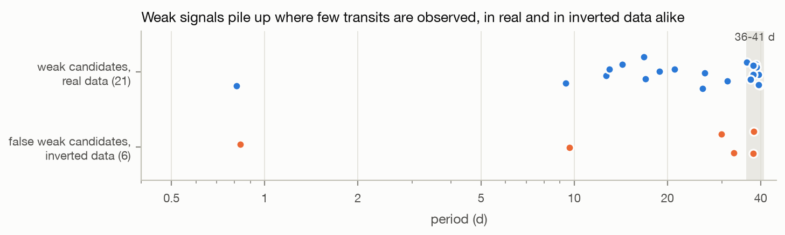

# 7. Weak signals

Twenty-one signals in no catalogue passed the rejecting tests but carried flags (usually a modest
red-noise SNR or uneven transit depths), so they were classified as *weak candidates* rather than
candidates. This chapter explains why most of them are expected to be false alarms and what the pixel
data add.

## 7.1 Expected false-alarm rate

The inverted-light-curve test (Chapter 3) produced false weak candidates on 3.0% of stars, or about 38
expected among the 1,279 searched. The real search produced 23 weak candidates in total (21 novel and 2
matching known signals). The number of weak candidates is therefore consistent with the number noise
alone produces, and they should be read as a list to re-check with more data, not as candidates.

## 7.2 Where the weak signals sit

Nine of the 21 have periods of 36–41 days, at the upper end of the search range, where a signal rests on
only a handful of transits (6–20 in the data) and a few coincident dips can masquerade as a periodic
signal. The inverted light curves, which contain no planets at all, place two of their six false weak
candidates in the same range.

*Figure 10. Periods of the 21 novel weak candidates (real data) and of the false weak candidates from
inverted light curves.*

## 7.3 Pixel re-check

Each weak signal was localized in the pixels (Chapter 4, `scripts/12_localize.py --weak`) and its
pixel-to-light-curve depth ratio measured (`scripts/16_weak_recheck.py`). With the 12% scatter seen
for confirmed planets added to each error, each signal falls in one of three classes:

| class | rule | signals |
|---|---|---|
| consistent | ratio within 2σ of 1 and the light loss detected at > 3σ in the pixels | 6 |
| marginal | neither consistent nor clearly absent | 9 |
| not in pixels | ratio more than 3σ below 1 | 6 |

A search tends to select noise peaks with inflated depths, so even a real weak signal would tend to come
out below one; a low ratio is therefore expected in part, but the six signals more than 3σ below one
(down to 0.03 ± 0.12) are dips that the processed light curve shows and the pixels do not, most likely
light-curve artefacts. None of the weak signals is localized off target with confidence: the largest
target exclusions (3.4–3.9σ) come with best-fit positions at the edge of the ±100″ search grid and with
pixel detections below 6σ.

| TIC | period (d) | depth (ppm) | R_p (R⊕) | SNR | pixel/light-curve ratio | pixel class | light-curve flags |
|---|---|---|---|---|---|---|---|
| 55450839 | 0.810 | 207 | 0.86 | 6.2 | 0.95 ± 0.26 | consistent | modest red-noise SNR 5.5 |
| 359482441 | 21.066 | 1063 | 1.21 | 7.3 | 0.75 ± 0.21 | consistent | modest red-noise SNR 5.3; transit depths vary by ~114% |
| 260658693 | 26.412 | 1280 | 1.24 | 7.1 | 0.63 ± 0.20 | consistent | transit depths vary by ~130% |
| 259039250 | 31.303 | 901 | 1.29 | 6.3 | 0.91 ± 0.28 | consistent | modest red-noise SNR 5.3; transit depths vary by ~91% |
| 260241701 | 39.348 | 1312 | 1.85 | 6.6 | 0.65 ± 0.19 | consistent | modest red-noise SNR 5.5; transit depths vary by ~110% |
| 38709037 | 39.797 | 667 | 1.46 | 6.1 | 0.68 ± 0.18 | consistent | modest red-noise SNR 5.5 |
| 350433316 | 9.375 | 996 | 1.68 | 6.6 | 0.67 ± 0.15 | marginal | modest red-noise SNR 6.0 |
| 359388713 | 12.674 | 1732 | 1.79 | 6.8 | 0.54 ± 0.17 | marginal | modest red-noise SNR 5.6 |
| 232629466 | 12.976 | 1623 | 2.02 | 6.5 | 0.59 ± 0.14 | marginal | modest red-noise SNR 5.7 |
| 356786247 | 14.303 | 448 | 0.98 | 6.8 | 0.66 ± 0.15 | marginal | modest red-noise SNR 6.4; transit depths vary by ~174% |
| 165471200 | 18.841 | 725 | 1.13 | 7.8 | 0.32 ± 0.26 | marginal | modest red-noise SNR 5.9 |
| 232649744 | 25.968 | 2589 | 1.30 | 6.0 | 0.64 ± 0.90 | marginal | modest red-noise SNR 6.4; transit depths vary by ~194% |
| 258923893 | 36.034 | 571 | 1.41 | 6.0 | 0.74 ± 0.29 | marginal | modest red-noise SNR 5.2; transit depths vary by ~327% |
| 349830417 | 37.940 | 2826 | 1.99 | 6.6 | 0.38 ± 0.22 | marginal | modest red-noise SNR 5.6; transit depths vary by ~102% |
| 258776466 | 39.376 | 1427 | 1.72 | 8.2 | 0.64 ± 0.15 | marginal | modest red-noise SNR 6.9; transit depths vary by ~153% |
| 260369411 | 16.818 | 1049 | 1.92 | 6.4 | 0.44 ± 0.13 | not in pixels | modest red-noise SNR 5.4 |
| 306574570 | 17.008 | 151 | 0.67 | 7.6 | 0.24 ± 0.07 | not in pixels | modest red-noise SNR 5.5; transit depths vary by ~289% |
| 311235628 | 37.195 | 1919 | 2.38 | 6.4 | 0.43 ± 0.12 | not in pixels | modest red-noise SNR 6.9 |
| 167087044 | 37.953 | 1707 | 1.60 | 9.1 | 0.30 ± 0.08 | not in pixels | modest red-noise SNR 5.9; transit depths vary by ~179% |
| 441728165 | 38.597 | 372 | 1.24 | 6.3 | 0.56 ± 0.11 | not in pixels | modest red-noise SNR 5.5; transit depths vary by ~160% |
| 232629466 | 38.772 | 2874 | 2.68 | 7.3 | 0.03 ± 0.12 | not in pixels | transit depths vary by ~161% |

Depths and radii in this table are the light-curve vetting measurements. For one signal (TIC 232649744)
the follow-up transit fit converged to an unphysical grazing solution (b = 1.08, 2.4% depth); the pixel
test uses the vetting ephemeris and depth instead, so that a failed fit cannot make a signal look absent
from the pixels.

## 7.4 Worth a second look

Among the six *consistent* signals, one stands out: **TIC 55450839** at 0.81 days, a 0.86 R⊕ object with
603 transit events in the pixels and a depth ratio of 0.95 ± 0.26. Its SNR (6.2) is below the candidate
threshold, so it is not a candidate, but the pixels see a dip of the expected size on the target. More
TESS data would decide it. The other five consistent signals lie at 21–40-day periods where few transits
exist and the light-curve flags (uneven transit depths) remain unexplained.
