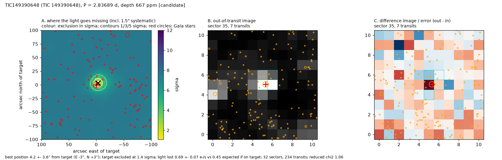

# TIC 149390648: Candidate

**1.00 ± 0.07 R_earth on a 2.8369-d orbit** (T_eq ~581 K) in a crowded southern field. SPOC flagged it once (s1-s96, SNR 8.5) and its difference-image offset was 2.2 ± 3.3", consistent with the target; this localization agrees (4.2 ± 3.6", every neighbour excluded at 3 sigma). The first half of the data alone does not lock onto the period (SNR 5.4 at a different period; second half 7.6 at this one), and the pixels lose 1.47 ± 0.23 times the expected light, the highest ratio in the set, which in a crowded field can mean the PDC crowding correction is imperfect. TRICERATOPS: FPP = nan, NFPP = nan; the NFPP is above the 0.001 validation limit because of the many faint neighbours. Ground-based photometry would settle it.

## Ephemeris and transit parameters
MCMC fit (emcee, batman; Rp/R*, b, stellar density with TIC prior, quadratic limb darkening with priors; 1-min folded bins with red-noise-scaled errors). Planet radius includes the TIC stellar-radius error.

| parameter | value |
|---|---|
| period (d) | 2.8368867 ± 0.0000038 |
| mid-transit (BJD_TDB) | 2459180.63416 ± 0.00148 |
| timing uncertainty on 2027 June 1 | ±5 min |
| depth (ppm) | 798 ± 88 |
| duration T14 (h) | 1.14 +0.07 −0.09 |
| Rp/R* | 0.0267 ± 0.0017 |
| impact parameter b | 0.51 +0.11 −0.13 |
| a/R* | 16.9 ± 0.6 |
| inclination (deg) | 88.3 +0.5 −0.4 |
| **planet radius (R_earth)** | **1.00 ± 0.07** |
| semi-major axis (AU) | 0.0271 ± 0.0013 |
| equilibrium temperature (K, zero albedo) | 581 ± 29 |
| insolation (Earth = 1) | 19 ± 4 |
| stellar density, transit shape alone / TIC | 0.81 ± 0.80 |

## Star
TESS mag 13.36; Teff 3382 ± 157 K; R* 0.345 ± 0.010 R_sun; M* 0.328 M_sun (TIC v8.2); distance 74.0 pc; Gaia DR3 4757656533594499840 (RUWE 1.23). 32 sectors of SPOC 2-min data.

## Detection and light-curve vetting
Red-noise-aware SNR 9.1; 242 transits with data; odd/even depths differ by 0.1 sigma; depth at phase 0.5: -121 ppm (-1.5 sigma); largest single-transit share 0.06; depth in SAP flux 818 ppm vs 829 ppm in PDCSAP. Independent searches of each half of the data: first half SNR 5.4 at a different period, second half SNR 7.6 at the same period.

## NASA SPOC pipeline history
| SPOC multi-sector run | SPOC period (d) | SPOC SNR | this light curve's SNR at SPOC's period | transit drift over the baseline (h) | SPOC difference-image offset |
|---|---|---|---|---|---|
| s0001-s0096 | 2.836865 | 8.5 | 8.6 | 0.4 | 2.2 ± 3.3" (0/32 difference images passed SPOC's quality test) |

At this work's period (2.836887 d) the same light curve gives box SNR 8.6. SPOC's SNR changes between runs follow its period estimate: a period error of a few 1e-5 d smears a sub-hour transit by hours over the ~2,000-d baseline.

## Pixel-level localization (where the light goes missing)
Difference images from 32 sectors (234 transits) fitted jointly with the SPOC PRF (scripts/12_localize.py). Errors include a 1.5" systematic floor measured on 46 cases with known sources.

* best-fitting source position: 4.2 ± 3.6" from the target (E -3", N +3"); the target is 1.4 sigma from the best position
* light lost in transit: 0.69 ± 0.07 e-/s; 0.45 e-/s expected if the target hosts the observed depth (ratio 1.52; confirmed planets in the test set span 0.85-1.30)
* nearest neighbours: Gaia DR3 4757656533592363648 at 15.4" (T = 20.5) excluded at 6.3 sigma; Gaia DR3 4757656533592367872 at 15.5" (T = 20.5) excluded at 6.0 sigma; Gaia DR3 4757656533594500352 at 15.9" (T = 17.4) excluded at 3.5 sigma
* neighbours not excluded at 3 sigma: none
* odd / even sectors separately: odd sectors 5.8 ± 4.6" (target 1.8 sigma); even sectors 2.2 ± 4.3" (target 0.4 sigma)

## Files
* follow-up sheet and vetting: `results/followup/TIC149390648_1.png`, `.json`
* transit fit: `results/hardening/mcmc/TIC149390648.png`, `.json`
* localization: `results/hardening/localize/TIC149390648.png`, `.json`
* TRICERATOPS: `results/hardening/triceratops/TIC149390648_result.json`
