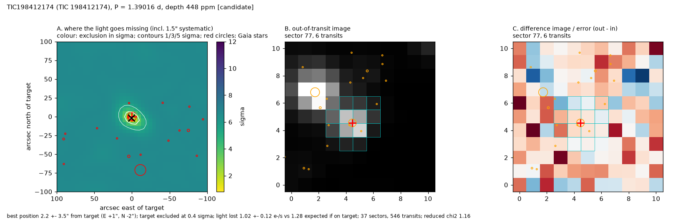

# TIC 198412174: Candidate (ambiguous host)

**1.35 ± 0.11 R_earth on a 1.3902-d orbit**, nearly grazing (b ~ 0.93). SPOC flagged it in three runs; as for TIC 229689348 the falling SPOC SNR follows SPOC's period error. The pixels put the source on or very near the target (2.2 ± 3.5") but **cannot separate the target from a T = 18.2 star 4.7" away** (excluded at only 1.3 sigma; it would need a ~11% eclipse); the planted-eclipse test shows that this pair is below the method's resolution. TRICERATOPS: FPP = 0.461 (NFPP 0.0007), dominated by a planet transiting an unresolved bound companion (46%) rather than the target (45%), because the transit is short for this star; clearing the neighbours the localization excludes gives FPP = 0.478, NFPP = 0.00001. High-resolution imaging (to find or exclude a companion and the 4.7" star) is the decisive next step.

## Ephemeris and transit parameters
MCMC fit (emcee, batman; Rp/R*, b, stellar density with TIC prior, quadratic limb darkening with priors; 1-min folded bins with red-noise-scaled errors). Planet radius includes the TIC stellar-radius error.

| parameter | value |
|---|---|
| period (d) | 1.3901602 ± 0.0000014 |
| mid-transit (BJD_TDB) | 2459644.31984 ± 0.00075 |
| timing uncertainty on 2027 June 1 | ±3 min |
| depth (ppm) | 382 ± 43 |
| duration T14 (h) | 0.61 ± 0.04 |
| Rp/R* | 0.0216 ± 0.0016 |
| impact parameter b | 0.93 ± 0.01 |
| a/R* | 7.6 ± 0.3 |
| inclination (deg) | 83.0 ± 0.3 |
| **planet radius (R_earth)** | **1.35 ± 0.11** |
| semi-major axis (AU) | 0.0202 ± 0.0009 |
| equilibrium temperature (K, zero albedo) | 954 ± 43 |
| insolation (Earth = 1) | 138 ± 25 |
| stellar density, transit shape alone / TIC | 6.77 +9.42 −6.61 |

## Star
TESS mag 11.82; Teff 3713 ± 157 K; R* 0.573 ± 0.017 R_sun; M* 0.565 M_sun (TIC v8.2); distance 77.1 pc; Gaia DR3 1437353828295347712 (RUWE 1.21). 37 sectors of SPOC 2-min data.

## Detection and light-curve vetting
Red-noise-aware SNR 9.7; 557 transits with data; odd/even depths differ by 0.0 sigma; depth at phase 0.5: -17 ppm (-0.5 sigma); largest single-transit share 0.06; depth in SAP flux 394 ppm vs 402 ppm in PDCSAP. Independent searches of each half of the data: first half SNR 7.6 at the same period, second half SNR 7.4 at the same period.

## NASA SPOC pipeline history
| SPOC multi-sector run | SPOC period (d) | SPOC SNR | this light curve's SNR at SPOC's period | transit drift over the baseline (h) | SPOC difference-image offset |
|---|---|---|---|---|---|
| s0014-s0050 | 1.390194 | 8.5 | 5.1 | 1.0 | 8.5 ± 6.0" (0/19 difference images passed SPOC's quality test) |
| s0014-s0086 | 1.390231 | 4.4 | 4.6 | 2.4 | 4.2 ± 5.1" (0/37 difference images passed SPOC's quality test) |

At this work's period (1.390160 d) the same light curve gives box SNR 10.2. SPOC's SNR changes between runs follow its period estimate: a period error of a few 1e-5 d smears a sub-hour transit by hours over the ~2,000-d baseline.

## Pixel-level localization (where the light goes missing)
Difference images from 37 sectors (546 transits) fitted jointly with the SPOC PRF (scripts/12_localize.py). Errors include a 1.5" systematic floor measured on 46 cases with known sources.

* best-fitting source position: 2.2 ± 3.5" from the target (E +1", N -2"); the target is 0.4 sigma from the best position
* light lost in transit: 1.02 ± 0.12 e-/s; 1.28 e-/s expected if the target hosts the observed depth (ratio 0.80; confirmed planets in the test set span 0.85-1.30)
* nearest neighbours: Gaia DR3 1437353828295869824 at 4.7" (T = 18.2) excluded at 1.3 sigma; Gaia DR3 1437353858359596928 at 21.6" (T = 19.6) excluded at 5.4 sigma; Gaia DR3 1437353789640128000 at 32.5" (T = 19.6) excluded at 6.3 sigma
* neighbours not excluded at 3 sigma: Gaia DR3 1437353828295869824 at 4.7" (T = 18.2; would need a 10.7% eclipse)
* odd / even sectors separately: odd sectors 2.2 ± 4.5" (target 0.3 sigma); even sectors 1.4 ± 4.5" (target 0.2 sigma)

## Statistical validation (TRICERATOPS)
FPP = 0.461 ± 0.016, NFPP = 0.00069 ± 0.00006 (5 runs of 1,000,000 draws; sectors [14, 26, 73, 86]; Gaia DR3 field population). Most probable scenarios: STP on TIC 198412174 45.8%, TP on TIC 198412174 45.3%, PTP on TIC 198412174 8.5%, SEBx2P on TIC 198412174 0.1%. No high-resolution imaging was used, so unresolved companions are limited only by Gaia; imaging would lower the FPP.

With the neighbours that the pixel localization excludes at more than 3 sigma treated as cleared (3 stars: TIC 1271156496 at 21.7" (5.4 sigma), TIC 198412168 at 50.9" (6.3 sigma), TIC 198412165 at 72.1" (6.3 sigma)), FPP = 0.478 ± 0.003 and NFPP = 0.00001 ± 0.00000.

## Files
* follow-up sheet and vetting: `results/followup/TIC198412174_1.png`, `.json`
* transit fit: `results/hardening/mcmc/TIC198412174.png`, `.json`
* localization: `results/hardening/localize/TIC198412174.png`, `.json`
* TRICERATOPS: `results/hardening/triceratops/TIC198412174_result.json`
