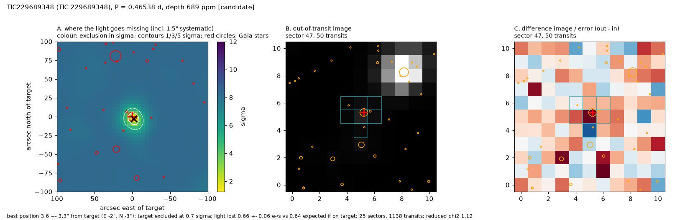

# TIC 229689348: Candidate

An **ultra-short-period candidate: 1.25 ± 0.08 R_earth on an 11.2-hour orbit** (T_eq ~1131 K, ~272x Earth's insolation), flat-bottomed, in 1138 transits and in both halves of the data. NASA's pipeline flagged it in three multi-sector runs but never promoted it; its reported SNR (5.8, 18.4, 3.8) tracks how far its period estimate was from the true one, not a fading signal. SPOC's difference images put the source 55" away in its best run, but none of them passed SPOC's own quality test; the joint PRF localization here, at the correct period with all 25 sectors, puts it on the target (3.6 ± 3.3"), excludes the bright 48.7" neighbour SPOC's offset pointed towards at 8.0 sigma and the 9.2" neighbour at 4.6 sigma, and synthetic eclipses planted on those neighbours are correctly traced to them. Pixel/light-curve depth ratio 1.02 ± 0.15. TRICERATOPS: FPP = 0.199, NFPP = 0.0010; the planet-on-target scenario carries 68% and the rest is almost all unresolved-companion scenarios (20% a planet on a bound companion), which high-resolution imaging would test. The transit is short for this star (b ~ 0.80), and the transit shape alone prefers a denser star (density 3.1 +1.4 -2.0 x the TIC value), which TRICERATOPS reads as some weight on a companion host.

## Ephemeris and transit parameters
MCMC fit (emcee, batman; Rp/R*, b, stellar density with TIC prior, quadratic limb darkening with priors; 1-min folded bins with red-noise-scaled errors). Planet radius includes the TIC stellar-radius error.

| parameter | value |
|---|---|
| period (d) | 0.46537689 ± 0.00000047 |
| mid-transit (BJD_TDB) | 2459027.62894 ± 0.00051 |
| timing uncertainty on 2027 June 1 | ±4 min |
| depth (ppm) | 693 +71 −59 |
| duration T14 (h) | 0.53 ± 0.02 |
| Rp/R* | 0.0266 ± 0.0014 |
| impact parameter b | 0.80 +0.03 −0.03 |
| a/R* | 4.4 ± 0.1 |
| inclination (deg) | 79.6 ± 0.7 |
| **planet radius (R_earth)** | **1.25 ± 0.08** |
| semi-major axis (AU) | 0.0089 ± 0.0004 |
| equilibrium temperature (K, zero albedo) | 1131 ± 56 |
| insolation (Earth = 1) | 272 ± 54 |
| stellar density, transit shape alone / TIC | 3.13 +1.40 −2.00 |

## Star
TESS mag 12.99; Teff 3365 ± 157 K; R* 0.430 ± 0.013 R_sun; M* 0.425 M_sun (TIC v8.2); distance 76.5 pc; Gaia DR3 1422141810046979584 (RUWE 1.02). 25 sectors of SPOC 2-min data.

## Detection and light-curve vetting
Red-noise-aware SNR 10.4; 1088 transits with data; odd/even depths differ by 1.0 sigma; depth at phase 0.5: -65 ppm (-1.1 sigma); largest single-transit share 0.02; depth in SAP flux 670 ppm vs 658 ppm in PDCSAP. Independent searches of each half of the data: first half SNR 8.5 at the same period, second half SNR 7.8 at the same period.

## NASA SPOC pipeline history
| SPOC multi-sector run | SPOC period (d) | SPOC SNR | this light curve's SNR at SPOC's period | transit drift over the baseline (h) | SPOC difference-image offset |
|---|---|---|---|---|---|
| s0014-s0055 | 0.465378 | 18.4 | 11.2 | 0.1 | 55.1 ± 9.6" (0/22 difference images passed SPOC's quality test) |
| s0014-s0086 | 0.465335 | 3.8 | 4.5 | 4.2 | 16.6 ± 6.6" (0/25 difference images passed SPOC's quality test) |

At this work's period (0.465377 d) the same light curve gives box SNR 11.2. SPOC's SNR changes between runs follow its period estimate: a period error of a few 1e-5 d smears a sub-hour transit by hours over the ~2,000-d baseline.

## Pixel-level localization (where the light goes missing)
Difference images from 25 sectors (1138 transits) fitted jointly with the SPOC PRF (scripts/12_localize.py). Errors include a 1.5" systematic floor measured on 46 cases with known sources.

* best-fitting source position: 3.6 ± 3.3" from the target (E -2", N -3"); the target is 0.7 sigma from the best position
* light lost in transit: 0.66 ± 0.06 e-/s; 0.64 e-/s expected if the target hosts the observed depth (ratio 1.02; confirmed planets in the test set span 0.85-1.30)
* nearest neighbours: Gaia DR3 1422141810046979968 at 9.2" (T = 15.9) excluded at 4.6 sigma; Gaia DR3 1422141805751675264 at 22.6" (T = 20.2) excluded at 6.7 sigma; Gaia DR3 1422142462882048000 at 25.5" (T = 17.7) excluded at 7.2 sigma
* neighbours not excluded at 3 sigma: none
* odd / even sectors separately: odd sectors 1.0 ± 3.8" (target 0.1 sigma); even sectors 5.8 ± 4.3" (target 1.3 sigma)

## Statistical validation (TRICERATOPS)
FPP = 0.199 ± 0.005, NFPP = 0.0010 ± 0.0000 (5 runs of 1,000,000 draws; sectors [15, 23, 49, 86]; Gaia DR3 field population). Most probable scenarios: TP on TIC 229689348 67.6%, STP on TIC 229689348 19.8%, PTP on TIC 229689348 12.3%, DTP on TIC 229689348 0.2%. No high-resolution imaging was used, so unresolved companions are limited only by Gaia; imaging would lower the FPP.

## Files
* follow-up sheet and vetting: `results/followup/TIC229689348_1.png`, `.json`
* transit fit: `results/hardening/mcmc/TIC229689348.png`, `.json`
* localization: `results/hardening/localize/TIC229689348.png`, `.json`
* TRICERATOPS: `results/hardening/triceratops/TIC229689348_result.json`
