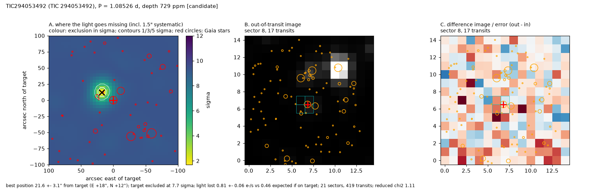

# TIC 294053492: False positive: nearby eclipsing binary

**Not a planet candidate on this star.** The light-curve signal (1.0853 d, depth ~856 ppm) passed every light-curve test, but the pixels place the light loss 21.6 ± 3.1" north-east of the target, excluding the target at 7.7 sigma; odd and even sectors each give the same off-target position on their own. The best-matching Gaia DR3 source is 5486535775331400832 (G = 19.8, 22.7" from the target and 2.1" from the best-fit position), which would need a ~16% eclipse: an ordinary eclipsing binary. More light goes missing than the target could lose for this depth (1.76x). TRICERATOPS, which has no pixel information, also flags a neighbour (NFPP = 0.30) but blames the bright star 22.6" to the north-west, which the pixels exclude at 8.3 sigma; the faint true source carries little prior weight there. This is what the hardening pass is for; the earlier write-up listed it as one of five candidates.

## Ephemeris and transit parameters
MCMC fit (emcee, batman; Rp/R*, b, stellar density with TIC prior, quadratic limb darkening with priors; 1-min folded bins with red-noise-scaled errors). Planet radius includes the TIC stellar-radius error. **These values assume the target hosts the signal; the pixels show it does not, so the planet radius, temperature and insolation below do not describe a real object.**

| parameter | value |
|---|---|
| period (d) | 1.0852647 ± 0.0000010 |
| mid-transit (BJD_TDB) | 2458619.00756 ± 0.00117 |
| timing uncertainty on 2027 June 1 | ±4 min |
| depth (ppm) | 856 ± 104 |
| duration T14 (h) | 1.00 ± 0.05 |
| Rp/R* | 0.0276 ± 0.0017 |
| impact parameter b | 0.40 +0.12 −0.20 |
| a/R* | 7.8 ± 0.3 |
| inclination (deg) | 87.1 +1.5 −1.0 |
| **planet radius (R_earth)** | **1.29 ± 0.09** |
| semi-major axis (AU) | 0.0156 ± 0.0007 |
| equilibrium temperature (K, zero albedo) | 852 ± 42 |
| insolation (Earth = 1) | 88 ± 17 |
| stellar density, transit shape alone / TIC | 0.67 ± 0.62 |

## Star
TESS mag 13.43; Teff 3374 ± 157 K; R* 0.427 ± 0.013 R_sun; M* 0.422 M_sun (TIC v8.2); distance 96.7 pc; Gaia DR3 5486535779627128448 (RUWE 1.08). 21 sectors of SPOC 2-min data.

## Detection and light-curve vetting
Red-noise-aware SNR 7.9; 424 transits with data; odd/even depths differ by 1.7 sigma; depth at phase 0.5: -14 ppm (-0.2 sigma); largest single-transit share 0.13; depth in SAP flux 833 ppm vs 1107 ppm in PDCSAP. Independent searches of each half of the data: first half SNR 8.3 at the same period, second half SNR 4.8 at the same period.

## Pixel-level localization (where the light goes missing)
Difference images from 21 sectors (419 transits) fitted jointly with the SPOC PRF (scripts/12_localize.py). Errors include a 1.5" systematic floor measured on 46 cases with known sources.

* best-fitting source position: 21.6 ± 3.1" from the target (E +18", N +12"); the target is 7.7 sigma from the best position
* light lost in transit: 0.81 ± 0.06 e-/s; 0.46 e-/s expected if the target hosts the observed depth (ratio 1.76; confirmed planets in the test set span 0.85-1.30)
* nearest neighbours: Gaia DR3 5486535779627127680 at 22.6" (T = 13.6) excluded at 8.3 sigma; Gaia DR3 5486535775331410304 at 22.6" (T = 19.1) excluded at 5.0 sigma; Gaia DR3 5486535775331400832 at 22.7" (T = 18.8) excluded at 0.0 sigma
* neighbours not excluded at 3 sigma: Gaia DR3 5486535775331400832 at 22.7" (T = 18.8; would need a 16.1% eclipse)
* odd / even sectors separately: odd sectors 18.4 ± 3.7" (target 6.1 sigma); even sectors 24.7 ± 3.7" (target 6.8 sigma)

## Statistical validation (TRICERATOPS)
FPP = 0.340 ± 0.003, NFPP = 0.29976 ± 0.00307 (5 runs of 1,000,000 draws; sectors [1, 8, 87, 96]; Gaia DR3 field population). Most probable scenarios: TP on TIC 294053492 54.8%, NTP on TIC 294053486 27.5%, PTP on TIC 294053492 10.9%, STP on TIC 294053492 4.0%. No high-resolution imaging was used, so unresolved companions are limited only by Gaia; imaging would lower the FPP.

## Files
* follow-up sheet and vetting: `results/followup/TIC294053492_1.png`, `.json`
* transit fit: `results/hardening/mcmc/TIC294053492.png`, `.json`
* localization: `results/hardening/localize/TIC294053492.png`, `.json`
* TRICERATOPS: `results/hardening/triceratops/TIC294053492_result.json`
