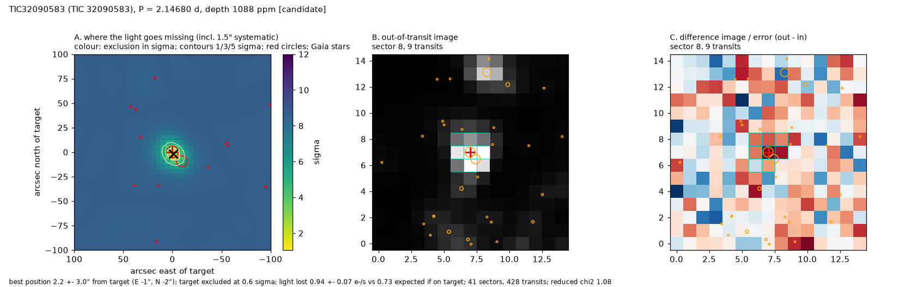

# TIC 32090583 (TOI-218): Candidate (strongest)

A **third transiting signal in the TOI-218 system**, found after the two known TOIs were masked: 1.05 ± 0.06 R_earth on a 2.1468-d orbit (T_eq ~578 K), not in any TOI, CTOI or SPOC TCE list. TOI-218 is one star of a wide binary: a near-twin M dwarf (same parallax and proper motion) sits 13.5" away and is blended with it in TESS. The pixel localization puts the new signal on the target (2.2 ± 3.0") and excludes the companion at 4.4 sigma; the two known TOI-218 signals also come from the target (8.7 and 6.8 sigma against the companion). The pixels lose 1.25 ± 0.18 times the light the light-curve depth predicts, TRICERATOPS gives FPP = 0.414 and NFPP = 0.3588, and both halves of the data recover it (SNR 11.0 and 8.4). TFOP notes call the host an eruptive (flaring) variable and suspect TOI-218.01 is stellar variability; flares are removed here and the new signal is a flat-bottomed, periodic, ~0.9-h dip seen in 400+ transits, unlike spot or flare activity. Extra candidates in systems that already have candidates are more often real. Next step: ground-based photometry resolving the binary, which also settles which star hosts TOI-218.02.

## Ephemeris and transit parameters
MCMC fit (emcee, batman; Rp/R*, b, stellar density with TIC prior, quadratic limb darkening with priors; 1-min folded bins with red-noise-scaled errors). Planet radius includes the TIC stellar-radius error.

| parameter | value |
|---|---|
| period (d) | 2.1467982 ± 0.0000019 |
| mid-transit (BJD_TDB) | 2459318.69707 ± 0.00102 |
| timing uncertainty on 2027 June 1 | ±3 min |
| depth (ppm) | 1273 ± 106 |
| duration T14 (h) | 0.93 +0.04 −0.06 |
| Rp/R* | 0.0339 ± 0.0017 |
| impact parameter b | 0.51 ± 0.10 |
| a/R* | 15.8 ± 0.5 |
| inclination (deg) | 88.1 ± 0.4 |
| **planet radius (R_earth)** | **1.05 ± 0.06** |
| semi-major axis (AU) | 0.0209 ± 0.0009 |
| equilibrium temperature (K, zero albedo) | 578 ± 30 |
| insolation (Earth = 1) | 19 +4 −3 |
| stellar density, transit shape alone / TIC | 1.10 +0.58 −0.77 |

## Star
TESS mag 13.33; Teff 3249 ± 157 K; R* 0.285 ± 0.009 R_sun; M* 0.259 M_sun (TIC v8.2); distance 52.3 pc; Gaia DR3 4667466549703138176 (RUWE 1.12). 41 sectors of SPOC 2-min data.

## Detection and light-curve vetting
Red-noise-aware SNR 11.1; 437 transits with data; odd/even depths differ by 0.9 sigma; depth at phase 0.5: -342 ppm (-2.9 sigma); largest single-transit share 0.03; depth in SAP flux 1422 ppm vs 1245 ppm in PDCSAP. Independent searches of each half of the data: first half SNR 11.0 at the same period, second half SNR 8.4 at the same period.

## Pixel-level localization (where the light goes missing)
Difference images from 41 sectors (428 transits) fitted jointly with the SPOC PRF (scripts/12_localize.py). Errors include a 1.5" systematic floor measured on 46 cases with known sources.

* best-fitting source position: 2.2 ± 3.0" from the target (E -1", N -2"); the target is 0.6 sigma from the best position
* light lost in transit: 0.94 ± 0.07 e-/s; 0.73 e-/s expected if the target hosts the observed depth (ratio 1.28; confirmed planets in the test set span 0.85-1.30)
* nearest neighbours: Gaia DR3 4667466549703138304 at 9.8" (T = 13.6) excluded at 4.4 sigma; Gaia DR3 4667466476687967488 at 34.6" (T = 19.9) excluded at 8.4 sigma; Gaia DR3 4667466511047710336 at 35.5" (T = 19.0) excluded at 8.4 sigma
* neighbours not excluded at 3 sigma: none
* odd / even sectors separately: odd sectors 1.0 ± 3.4" (target 0.2 sigma); even sectors 4.2 ± 3.8" (target 1.0 sigma)

## Statistical validation (TRICERATOPS)
FPP = 0.414 ± 0.012, NFPP = 0.3588 ± 0.0106 (5 runs of 1,000,000 draws; sectors [1, 28, 64, 98]; Gaia DR3 field population). Most probable scenarios: TP on TIC 32090583 50.4%, NTP on TIC 32090581 35.9%, PTP on TIC 32090583 8.0%, STP on TIC 32090583 5.5%. No high-resolution imaging was used, so unresolved companions are limited only by Gaia; imaging would lower the FPP.

## Files
* follow-up sheet and vetting: `results/followup/TIC32090583_5.png`, `.json`
* transit fit: `results/hardening/mcmc/TIC32090583.png`, `.json`
* localization: `results/hardening/localize/TIC32090583.png`, `.json`
* TRICERATOPS: `results/hardening/triceratops/TIC32090583_result.json`
